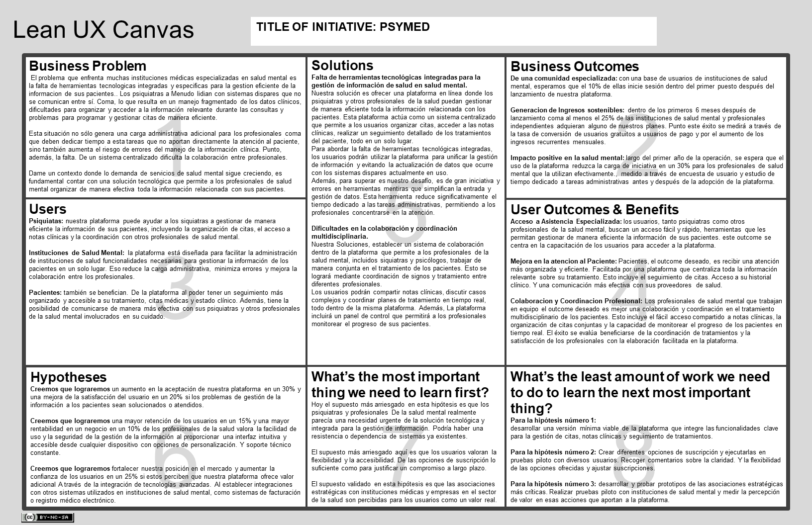

# **CAPÍTULO I: INTRODUCCIÓN**
## 1.1. StartUp Profile
### 1.1.1. Description de la StartUp
PsyMed es una plataforma web diseñada para optimizar la gestión y el seguimiento de pacientes en centros psiquiátricos. La aplicación facilita la comunicación continua entre psiquiatras y pacientes, permitiendo un monitoreo integral del progreso, el seguimiento personalizado de tratamientos, y la gestión eficiente de citas y notas clínicas en un entorno seguro y accesible. PsyMed se enfoca en mejorar la calidad de la atención al proporcionar herramientas que permiten a los profesionales de la salud mental mantenerse conectados con sus pacientes de manera efectiva y con información actualizada en todo momento.

### 1.1.2. Perfiles de integrantes del equipo
<table>
  <tr>
  <th colspan="2">Riega Salas Jose Miguel</th>
  </tr>
  <tr>
    <td></td>
    <td> Soy estudiante de ingenieria de software en la universidad de ciencias aplicadas, me considero apasionado por el aprendizaje continuo, polivalente y responsable; en busca de nuevas oportunidades y de dedicarme en lo que me apasiona. Poseo conocimientos en metodologias ágiles y lenguajes como C++, Javascript, HTML, Python y Angular. </td>
  </tr>

  <tr>
  <th colspan="2">Palomino Hurtado, Juan Francisco</th>
  </tr>
  <tr>
    <td></td>
    <td> Tengo 20 años y soy estudiante de la Universidad Peruana de Ciencias Aplicadas y actualmente me encuentro en el séptimo ciclo de la carrera de Ingeniería de Software, cuento con una gran fluidez verbal, lo cual me permite trabajar en equipo. Cuento con un nivel alto en HTML, CSS, JavaScript, Vue.j y Astro 5. Además, cuento con un gran conocimiento en edición de videos e imágenes. </td>
  </tr>

  <tr>
  <th colspan="2">Galvan Cerron, George Aldo</th>
  </tr>
  <tr>
    <td></td>
    <td> Soy estudiante de la carrera de Ingeniería de Software en la Universidad Peruana de Ciencias Aplicadas, tengo experiencia en desarrollo de aplicaciones web con lenguajes como C#, Java, Python y C++ en backend. Por otro lado también tengo afinidad con Vue y Angular en desarrollo Frontend </td>
  </tr>

  <tr>
    <th colspan="2">Guerrero Vasquez, Jhon Danny </th>
  </tr>
  <tr>
    <td></td>
    <td> Soy estudiante de Ingeniería de Software en la Universidad Peruana de Ciencias Aplicadas, con un marcado interés en algoritmos y estructuras de datos. Manejo C++ con solidez y tengo afinidad por JavaScript y el desarrollo frontend, especialmente en la creación de interfaces dinámicas y orientadas a la experiencia del usuario.</td>
  </tr>

  <tr>
    <th colspan="2">Iparraguirre Rueda, Cristian Luis</th>
  </tr>
  <tr>
    <td></td>
    <td> Soy una persona con habilidades de aprendizaje rápido, lo que me permite optimizar tanto mi trabajo individual como en equipo para alcanzar los objetivos establecidos. Tengo experiencia trabajando en equipo, contribuyendo con ideas creativas y soluciones prácticas. Me apasiona aprender sobre nuevas tecnologías y mantengo una actitud perseverante en el desarrollo de cualquier proyecto. Tengo conocimientos sólidos en C#, Java, Python, C++, SQL y NoSQL, así como en el desarrollo web con HTML, CSS y JavaScript. Mi enfoque está en la resolución de problemas a través de la programación y en el manejo de bases de datos. Disfruto aprendiendo y explorando nuevas tecnologías, lo que me permite optimizar mis proyectos para que se completen de manera innovadora y efectiva. </td>
  </tr>

  <tr>
    <th colspan="2"> Reyes Valenzuela, Renato German </th>
  </tr>
  <tr>
    <td></td>
    <td> Mi nombre es **Renato German Reyes Valenzuela** y tengo 23 años. Soy estudiante de la carrera de ingeniería de software de la UPC (Universidad Peruana de Ciencias Aplicadas). Estoy en el sexto ciclo de mi carrera. Gracias a los cursos que estuve llevando los últimos ciclos, más el aprendizaje extracurricular, cuento con la capacidad y conocimientos para desarrollarme correctamente con los avances y desarrollo de la propuesta de trabajo que ofrecemos. Por último, destaco mi capacidad de empatía y compañerismo para poder avancar de manera grupal los sprint correspondientes y apoyarme en lo necesario con mis compañeros.</td>

</table>

## 1.2. Solution Profile
### 1.2.1. Antecedentes y problematica
Para analizar los antecedentes y problemáticas del desarrollo nuestro proyecto, estaremos utilizando la técnica de las 5W y 2H (Who, What, When, Where, Why, How, How much). La cual ha sido estructurada de la siguiente manera:

- **Who:** El problema afecta a los psiquiatras, pacientes con trastornos mentales, y al sistema de salud en general.
    
- **What:** A pesar de las políticas de salud pública que han dado mayor importancia a la salud mental, el sistema sigue siendo incapaz de atender a la gran mayoría de la población afectada por trastornos mentales, como la depresión y la ansiedad.
    
- **Where:** Esta problemática es particularmente visible en Perú, donde el Ministerio de Salud y la Defensoría del Pueblo han documentado una grave falta de recursos en las instituciones de salud mental.
    
- **When:** El déficit en la atención de la salud mental ha sido un problema desde al menos 2016, y se ha agravado en los últimos años, especialmente desde 2021, cuando se reportaron más de un millón de casos de problemas de salud mental.
    
- **Why:** La saturación del sistema de salud y la falta de recursos humanos y financieros son las principales causas de este problema, lo que resulta en que 8 de cada 10 personas no reciban la atención que necesitan.
    
- **How:** El déficit se manifiesta en la escasez de profesionales especializados en salud mental (solo 2 a 3 médicos por cada 100,000 habitantes), y en la carga administrativa que enfrenta el personal médico, lo que dificulta aún más la prestación de atención adecuada.
    
- **How Much:** La magnitud del problema es alarmante, con más de 1 millón de personas afectadas que no reciben la atención necesaria, lo que representa un desafío urgente para el sistema de salud.

Esta estructura nos permite una comprensión clara y detallada de los antecedentes y problemáticas relacionadas con el desarrollo de la aplicación web para recomendaciones de videojuegos.

- Descripción de la Problemática:

El sistema de salud mental en Perú enfrenta una crisis debido a la sobrecarga administrativa que limita la capacidad de los profesionales para atender a los pacientes. La creciente demanda de atención en salud mental, impulsada por trastornos como la depresión y la ansiedad, ha llevado a un sistema que lucha por gestionar de manera eficiente las citas, los historiales clínicos y la comunicación entre médicos y pacientes.

Para superar este desafío, es esencial implementar soluciones tecnológicas que optimicen la administración de los pacientes. Automatizar tareas para liberar tiempo para los profesionales de la salud, permitiéndoles enfocarse más en la atención directa y mejorando así el acceso y la calidad de la atención en salud mental en Perú

¿Cómo pueden las soluciones tecnológicas mejorar la gestión y administración del servicio de salud mental en Perú?

### 1.2.2 Lean UX Process.
#### 1.2.2.1. Lean UX Problem Statements.

Estamos desarrollando una plataforma de software para instituciones médicas especializadas en salud mental, diseñada para mejorar la gestión integrada y eficiente de la información de pacientes y médicos. Las herramientas tecnológicas actuales en estas instituciones no satisfacen las necesidades específicas de gestión, lo que provoca un manejo fragmentado de datos clínicos, complicaciones en la organización y acceso a información durante las consultas, y dificultades en la programación y gestión eficiente de citas. Esta situación impone una carga administrativa adicional sobre los profesionales de salud mental, aumenta el riesgo de errores en el manejo de información clínica, y limita la capacidad de ofrecer un tratamiento multidisciplinario efectivo.
>*Según el análisis de funcionalidades médicas en línea de 200 hospitales en América Latina y el Caribe, aunque la adopción de agendas en línea y la visualización de exámenes médicos es significativa, la implementación de servicios de telemedicina y otras funcionalidades presenta un margen considerable para el desarrollo y la mejora (s.f.).*

¿Cómo podemos desarrollar esta plataforma para que los profesionales de la salud mental puedan organizar mejor la información de sus pacientes, reducir la carga administrativa, y mejorar la calidad del servicio y la satisfacción de los pacientes, basándonos en criterios medibles como la eficiencia operativa, la precisión en el manejo de la información clínica, y la colaboración entre profesionales? reducir la carga administrativa, y en última instancia, mejorar la calidad del servicio y la satisfacción de los pacientes, basándonos en criterios medibles como la eficiencia operativa, la precisión en el manejo de la información clínica, y la colaboración entre profesionales?*

Esta plataforma debe ser segura, fácil de usar, y capaz de integrar todas las funcionalidades necesarias para la gestión diaria en un solo lugar, permitiendo así una mejora significativa en la organización de las consultas, el acceso a la información y la coordinación entre los diferentes profesionales y abriendo la posibilidad para integraciones de IOT dentro de la institución.

- **Customer Segments**: Los usuarios principales de esta plataforma serán los profesionales de la salud mental, y otros especialistas que trabajan en instituciones médicas dedicadas a la salud mental. También incluye al personal administrativo encargado de la gestión de citas y la organización de información clínica.
    
- **Pain Points**:
Las herramientas tecnológicas actuales en estas instituciones no cumplen con las necesidades específicas de gestión, resultando en un manejo fragmentado de los datos clínicos. Esto causa dificultades para organizar y acceder a la información relevante durante las consultas y problemas para programar y gestionar citas de manera eficiente. Esta situación genera una carga administrativa adicional para los profesionales de la salud mental, aumenta el riesgo de errores en el manejo de la información clínica, y limita la capacidad de ofrecer un enfoque de tratamiento multidisciplinario.
    
- **Gap**: Existe una brecha significativa en el mercado en cuanto a soluciones tecnológicas integradas y especializadas para la gestión de información en instituciones de salud mental. Aunque muchas instituciones han adoptado herramientas básicas como agendas en línea, aún no se ha implementado una plataforma que integre todas las funcionalidades necesarias para la gestión eficiente y segura de la información clínica.
    
- **Vision/Strategy**: Nuestra visión es desarrollar una plataforma que centralice todas las funcionalidades necesarias para la gestión diaria en un solo lugar, asegurando que sea segura, fácil de usar, y capaz de mejorar la organización de consultas, el acceso a la información, y la coordinación entre los diferentes profesionales. La estrategia incluye integrar funcionalidades como la gestión de citas, acceso a datos clínicos, y soporte para tratamientos multidisciplinarios, con la posibilidad de futuras integraciones de IoT dentro de las instituciones.
    
- **Initial Segment**: El segmento inicial para la implementación de esta plataforma estará compuesto por instituciones médicas de salud mental en América Latina que ya muestran un interés en modernizar su gestión interna y que han adoptado parcialmente herramientas digitales, pero carecen de una solución integrada que cubra todas sus necesidades.

A partir de lo anterior, presentamos los **Problem Statements** identificados:
1. **Problem Statement 1: Fragmentación en el Manejo de Datos Clínicos**
   * Las herramientas tecnológicas actuales en instituciones de salud mental no satisfacen las necesidades específicas de gestión, lo que provoca una fragmentación en el manejo de datos clínicos.

Solution: Desarrollar una plataforma centralizada que integre todas las funcionalidades necesarias para la gestión de datos clínicos en un solo lugar.   
     
2. **Problem Statement 2: Dificultades en la Organización y Acceso a Información durante las Consultas**
   * Los profesionales de la salud mental enfrentan complicaciones para organizar y acceder a información relevante durante las consultas.

Solution: Implementar un sistema intuitivo de búsqueda y filtrado de información dentro de la plataforma, permitiendo que los profesionales accedan rápidamente a la información más relevante para cada consulta.
      
3. **Problem Statement 3: Problemas en la Programación y Gestión Eficiente de Citas**
   * Las herramientas actuales dificultan la programación y gestión eficiente de citas.

Solution: Incorporar un módulo de gestión de citas que permita a los profesionales y pacientes programar, modificar y cancelar citas fácilmente.
      
4. **Problem Statement 4: Carga Administrativa Adicional para los Profesionales de la Salud Mental**
   * La situación actual genera una carga administrativa significativa para los profesionales de la salud mental.

Solution: Automatizar procesos administrativos dentro de la plataforma, como la generación de informes, la actualización de registros y la gestión de citas.
      
5. **Problem Statement 5: Riesgo Incrementado de Errores en el Manejo de la Información Clínica**
    * La fragmentación y las dificultades mencionadas aumentan el riesgo de cometer errores en el manejo de la información clínica.

Solution: Implementar mecanismos de verificación y validación de datos dentro de la plataforma, además de controles de calidad automáticos para reducir la posibilidad de errores. También se podría incluir un sistema de auditoría que permita rastrear cambios en la información clínica para garantizar la precisión y seguridad de los datos.
      
6. **Problem Statement 6: Limitación en la Capacidad de Ofrecer un Enfoque de Tratamiento Multidisciplinario**
    * Los problemas actuales limitan la capacidad de los profesionales de salud mental para ofrecer un enfoque de tratamiento multidisciplinario eficaz.

Solution: Desarrollar funcionalidades colaborativas dentro de la plataforma que permitan a los diferentes profesionales de la salud mental acceder y compartir información de manera segura y en tiempo real.
  

Estas soluciones están diseñadas para abordar de manera integral los desafíos identificados, mejorando la eficiencia y calidad de la atención en instituciones de salud mental.

#### 1.2.2.2. Lean UX Assumptions.
Bussiness Assumptions:

1. **Creemos que nuestros clientes tienen la necesidad de:**

Organizar y gestionar de manera eficiente la información de los pacientes, citas, y datos clínicos.

2. **Estas necesidades se pueden satisfacer con:**  
   
Una plataforma centralizada y específica para las instituciones de salud mental, que optimice sus procesos internos, reduzca errores y mejore la calidad de la atención.

3. **Nuestros clientes iniciales son (o serán):**  
   
Instituciones de salud mental que buscan modernizar y centralizar su gestión de información.

4. **El valor principal que un cliente quiere obtener de nuestro servicio es:**  
   
Eficiencia operativa y reducción de errores en la gestión de información clínica.

5. **Los clientes también pueden obtener estos beneficios adicionales:**  

Mejora en la calidad del servicio, mayor seguridad de los datos y una mejor coordinación entre profesionales.

6. **Adquiriremos a la mayoría de nuestros clientes a través de:**  

La venta de licencias de uso del software y tarifas de suscripción mensuales.

7. **Ganaremos dinero mediante:**  
   
Ofreciendo módulos adicionales de la plataforma, como la integración con sistemas de facturación o la expansión de la capacidad de almacenamiento de datos.

8. **Nuestra competencia principal en el mercado será:**  
   
Plataformas de gestión médica que no están especializadas en salud mental.

9. **Les superaremos debido a:**  
   
Nuestro enfoque especializado y las funcionalidades integradas que abordan las necesidades específicas de las instituciones de salud mental en particular.

10. **El mayor riesgo para nuestro producto es:**  

Que la funcionalidad de gestión de citas no se integre correctamente con el resto de la plataforma o que las instituciones no perciban un valor claro en la adopción de una nueva plataforma tecnológica.

 ---

User Assumptions:

1. **¿Quién es el usuario?**  

Los usuarios son profesionales de la salud mental, como psiquiatras y psicólogos, que necesitan gestionar la información de sus pacientes de manera eficiente.

2. **¿Dónde encaja nuestro producto en su trabajo o vida?**  
  
Nuestro producto encaja en su trabajo diario, ayudando en la gestión de citas, seguimiento de tratamientos y acceso a datos clínicos.

3. **¿Qué problemas resuelve nuestro producto?**  
   
Resuelve la gestión fragmentada de la información, la dificultad en la programación de citas, y mejora la coordinación entre profesionales.

4. **¿Cuándo y cómo se utiliza nuestro producto?**  
   
Se utiliza diariamente para gestionar citas y consultas, así como para la coordinación entre profesionales.

5. **¿Qué características son importantes?**  
   
La integración de datos clínicos, la programación de citas, las notificaciones automáticas, la seguridad en la información, y una interfaz intuitiva que permita un acceso rápido y seguro a la información durante la programación de consultas.

6. **¿Cómo debería verse y comportarse nuestro producto?**  
   
Debe ser intuitivo, fácil de usar, con una interfaz limpia y opciones de personalización para diferentes tipos de usuarios.

7. **El valor principal que un usuario quiere obtener de nuestra funcionalidad es:**  
   
Reducción de errores administrativos y una gestión más eficiente de los horarios.

8. **Los usuarios también pueden obtener estos beneficios adicionales:**  
   
Acceso rápido y seguro a la información durante la programación de consultas.

9. **El mayor riesgo para el usuario es:**  
   
Que los profesionales encuentren la plataforma difícil de usar o que no se ajuste a su flujo de trabajo diario.

---

User Outcomes:

- **Acceso a Asistencia Especializada:** Los usuarios, tanto psiquiatras como otros profesionales de la salud mental, buscan un acceso fácil y rápido a herramientas que les permitan gestionar de manera eficiente la información de sus pacientes. Este outcome se centra en la capacidad de los usuarios para acceder a una plataforma integrada que optimice la organización de citas, notas clínicas y tratamientos, lo que les proporciona confianza y apoyo en la prestación de un cuidado de calidad.
  
- **Mejora en la Atención al Paciente:** Para los pacientes, el outcome deseado es recibir una atención más organizada y eficiente, facilitada por una plataforma que centraliza toda la información relevante sobre su tratamiento. Esto incluye el seguimiento de citas, acceso a su historial clínico, y una comunicación más efectiva con sus proveedores de salud mental. El éxito se mide por la satisfacción del paciente y la mejora en la calidad del cuidado recibido.
  
- **Colaboración y Coordinación Profesional:** Para los profesionales de la salud mental que trabajan en equipo, el outcome deseado es una mejor colaboración y coordinación en el tratamiento multidisciplinario de los pacientes. Esto incluye el fácil acceso compartido a notas clínicas, la organización de citas conjuntas, y la capacidad de monitorear el progreso de los pacientes en tiempo real. El éxito se evalúa por la eficiencia en la coordinación de tratamientos y la satisfacción de los profesionales con la colaboración facilitada por la plataforma.

---

Business Outcomes:

- **Desarrollo de una Comunidad Especializada:** Con una base de usuarios en instituciones de salud mental, esperamos que el 10% de ellos inicie sesión dentro del primer mes después del lanzamiento de la plataforma. Al proporcionar herramientas especializadas para la gestión de la salud mental, la plataforma puede convertirse en un punto de referencia para psiquiatras, psicólogos, y otros profesionales interesados en mejorar la eficiencia operativa y la calidad del cuidado. Esto puede fomentar el intercambio de conocimientos y mejores prácticas dentro de la comunidad de salud mental.
    
- **Generación de Ingresos Sostenibles:** Esperamos que, dentro de los primeros seis meses después del lanzamiento, al menos el 25% de las instituciones de salud mental y profesionales independientes que utilicen la versión gratuita de la plataforma se conviertan en suscriptores de pago. Este éxito se medirá a través de la tasa de conversión de usuarios gratuitos a usuarios pagos y por el aumento en los ingresos recurrentes mensuales. La satisfacción del usuario y la retención de suscripciones a largo plazo serán indicadores clave para evaluar la sostenibilidad financiera de la plataforma.
    
- **Impacto Positivo en la Salud Mental:** A lo largo del primer año de operación, se espera que el uso de la plataforma reduzca la carga administrativa en un 30% para los profesionales de salud mental que la utilicen activamente, medido a través de encuestas de usuario y estudios de tiempo dedicados a tareas administrativas antes y después de la adopción de la plataforma. Además, se busca que al menos el 20% de los pacientes tratados a través de la plataforma reporten mejoras en la satisfacción con la atención recibida, lo que se evaluará mediante encuestas periódicas a los pacientes.

--- 

Features Assumptions:

**1. Acceso a Herramientas de Gestión Especializadas:**

- **Gestión de Citas y Tratamientos:**
Implementar una funcionalidad que permita a los usuarios organizar y gestionar citas de manera eficiente, directamente integrada con los registros de los pacientes y las notas clínicas. Esto facilitará la planificación y el seguimiento de los tratamientos, reduciendo la posibilidad de errores administrativos.
  
- **Historial Clínico Accesible:**
Desarrollar una funcionalidad que permita a los profesionales de la salud mental acceder de manera rápida y segura al historial clínico completo de los pacientes, garantizando que toda la información relevante esté disponible durante las consultas.

**2. Mejora en la Atención al Paciente:**

- **Portal de Pacientes:**
Crear un portal dedicado para los pacientes donde puedan revisar su historial, seguir sus tratamientos, y comunicarse con sus psiquiatras y otros profesionales de manera segura. Este portal incluirá recordatorios de citas y acceso a recursos educativos sobre su salud mental.
  
- **Encuestas de Satisfacción:** 
Implementar encuestas automatizadas que se envíen a los pacientes después de las consultas o tratamientos, permitiendo a los profesionales de la salud mental recopilar retroalimentación directa y mejorar la calidad de la atención.

**3. Colaboración y Coordinación Profesional:**

- **Plataforma de Colaboración Multidisciplinaria:** 
Desarrollar una herramienta de colaboración que permita a psiquiatras, psicólogos, y otros profesionales de la salud mental compartir notas, discutir casos, y coordinar tratamientos de manera integrada. Esta herramienta facilitará un enfoque de tratamiento más cohesivo y efectivo para los pacientes.
  
- **Panel de Control para Seguimiento:** 
Crear un panel de control que permita a los profesionales monitorear el progreso de los pacientes en tiempo real, facilitando la coordinación y el seguimiento de los tratamientos multidisciplinarios.
    

  #### 1.2.2.3. Lean UX Hypothesis Statements

1. **Creemos que lograremos** un aumento en la aceptación de nuestra plataforma y una mejor satisfacción del usuario **si** los problemas de gestión de la información de los pacientes se ven solucionados o atendidos. **Al ofrecer** una plataforma centralizada que permita a los profesionales de la salud mental gestionar toda la información de los pacientes de manera integrada y eficiente, **con la implementación** de funcionalidades específicas para la gestión de citas, notas clínicas y seguimiento de tratamientos, se podrá mejorar significativamente la organización y el acceso a los datos clínicos.   
2. **Creemos que lograremos** una mayor retención de usuarios y una mayor rentabilidad del negocio **si** los profesionales de la salud mental valoran la facilidad de uso y la seguridad en la gestión de la información. **Al proporcionar** una interfaz intuitiva y accesible desde cualquier dispositivo, con opciones de personalización y soporte técnico constante, **con la optimización** de la usabilidad después de realizar pruebas piloto con diferentes flujos de trabajo y entender las necesidades de los usuarios, se facilitará la adopción y el uso continuo de la plataforma.   
3. **Creemos que lograremos** fortalecer nuestra posición en el mercado y aumentaremos la confianza de los usuarios **si** estos perciben que nuestra plataforma ofrece valor adicional a través de integraciones tecnológicas avanzadas. **Al establecer** integraciones con otros sistemas utilizados en las instituciones de salud mental, como sistemas de facturación o de registro médico electrónico, **con la identificación** y el desarrollo de módulos adicionales, y la realización de pruebas piloto para garantizar la compatibilidad, se ofrecerá un valor añadido que diferenciará a nuestra plataforma de las opciones existentes.   
4. **Creemos que lograremos** aumentar la satisfacción del usuario, la fidelidad a nuestra plataforma y el boca a boca positivo **si** los usuarios experimentan una reducción en la carga administrativa y una mejora en la coordinación entre profesionales. **Al mejorar** la funcionalidad de gestión de citas y la visualización de información clínica de manera integrada, basándonos en pruebas de usabilidad y recopilación de testimonios directos de usuarios, **con la implementación** de mejoras que simplifiquen las tareas administrativas y fomenten la colaboración multidisciplinaria, se mejorará la experiencia general del usuario.   
5. **Creemos que** impulsaremos el crecimiento de nuestra base de usuarios y la expansión de nuestra plataforma **si** los profesionales de la salud mental se familiarizan con nuestra solución a través de campañas de marketing dirigidas. **Al realizar** campañas de marketing piloto dirigidas a instituciones de salud mental y profesionales independientes, **con la realización** de presentaciones en conferencias y la adaptación de nuestra estrategia de marketing según los resultados obtenidos, se logrará una mayor adopción de la plataforma.

#### 1.2.2.4. Lean UX Canvas

## 1.3. Segmentos Objetivos
El segmento objetivo de este análisis se centra en dos grupos principales:
1. **Psiquiatras y Profesionales de la Salud Mental:**

Psiquiatras, que trabajan tanto en el sector público como en el privado. Generalmente, se encuentran en las principales ciudades del país, como Lima, Arequipa y Trujillo. En Perú, hay un déficit significativo de profesionales especializados en salud mental, con solo 2 a 3 psiquiatras por cada 100,000 habitantes. Esta escasez genera una sobrecarga de trabajo, afectando la calidad de la atención y la eficiencia en el manejo de casos clínicos.
     
2. **Pacientes con Trastornos Mentales:**

Individuos de todas las edades y géneros, pero con un mayor enfoque en adultos jóvenes (18-35 años) y mujeres, quienes son más propensas a buscar atención para trastornos como la depresión y la ansiedad. Más de un millón de personas en Perú padecen trastornos mentales, y 8 de cada 10 no reciben la atención que necesitan. Los casos han aumentado significativamente desde 2021, reflejando la gravedad de la crisis en la salud mental en el país.
