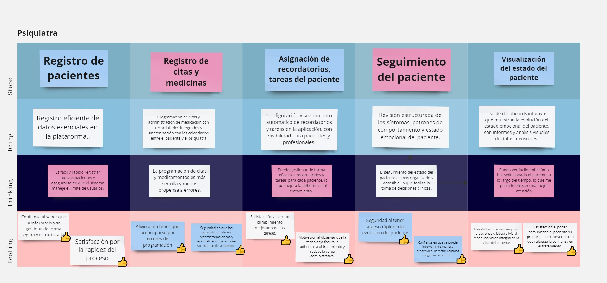
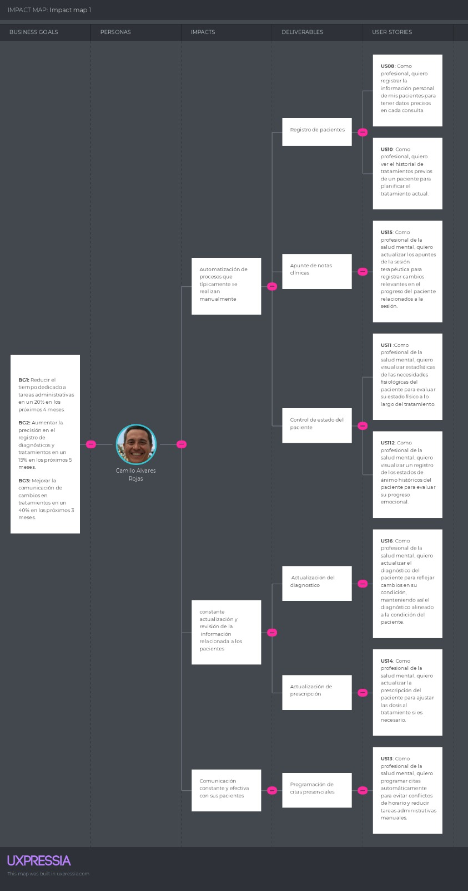
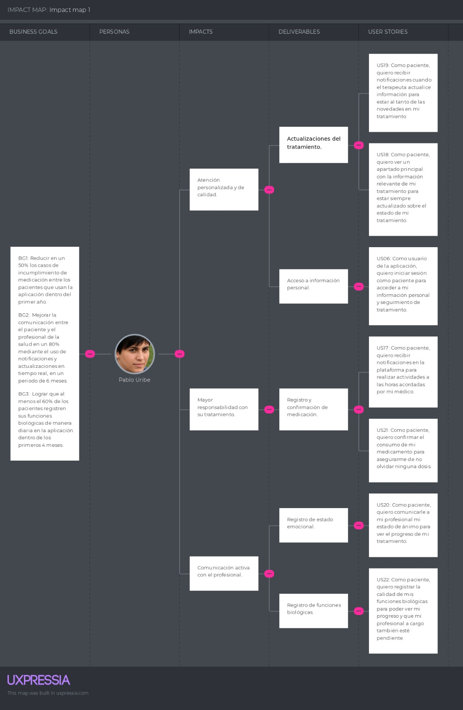

# **CAPÍTULO III: REQUIREMENTS SPECIFICATIONS**
## 3.1. To-Be Scenario Mapping
**Pacientes:**

**Medicos:**

## 3.2. User Stories
<!-- EPIC 1 -->
<table>
  <tr>
    <th>EPIC ID</th>
    <th>01</th>
    <th>TITLE: Accesibilidad de la Landing Page</th>
  </tr>
  <tr>
    <td colspan="3">
      <strong>Cómo</strong> visitante de la Landing Page, 
      <strong>quiero</strong> que la información sobre la aplicación sea fácil de entender 
      <strong>para</strong> poder comprender rápidamente su propósito.
    </td>
  </tr>
</table>

<!-- USER STORIE 1 -->
<table>
  <tr>
    <th>USER STORY ID</th>
    <th>US01</th>
    <th>EPIC ID</th>
    <th>EP01</th>
  </tr>
  <tr>
    <th>TITLE</th>
    <td colspan="3">Adaptabilidad y compatibilidad de la Landing Page</td>
  </tr>
  <tr>
    <th>DESCRIPTION</th>
    <td colspan="3">Como visitante de la Landing Page, <strong>quiero</strong> que el contenido se adapte al tamaño de la pantalla del dispositivo desde el que accede <strong>para</strong> obtener la información de manera ordenada.</td>
  </tr>
  <tr>
    <th>ACCEPTANCE CRITERIA</th>
    <td colspan="3">
      <strong>Scenario 1: Adaptabilidad a diferentes tamaños de pantalla</strong> 
      <strong>Given</strong> el visitante se encuentra en la landing page, 
      <strong>When</strong> ingresa al sitio web, 
      <strong>Then</strong> la landing page debe poseer un contenido que se ajuste automáticamente al tamaño de la pantalla.  
      <strong>Scenario 2: Compatibilidad con navegadores principales</strong> 
      <strong>Given</strong> el visitante se encuentra en la landing page, 
      <strong>When</strong> utiliza su navegador de preferencia, 
      <strong>Then</strong> la landing page debe ser compatible.
    </td>
  </tr>
</table>

<!-- USER STORIE 2 -->
<table>
  <tr>
    <th>USER STORY ID</th>
    <th>US02</th>
    <th>EPIC ID</th>
    <th>EP01</th>
  </tr>
  <tr>
    <th>TITLE</th>
    <td colspan="3">Encontrar información del propósito de la aplicación</td>
  </tr>
  <tr>
    <th>DESCRIPTION</th>
    <td colspan="3">Como visitante de la Landing Page, <strong>quiero</strong> encontrar fácilmente la información que explique el propósito de la aplicación <strong>para</strong> comprender cómo puede ser útil para mí.</td>
  </tr>
  <tr>
    <th>ACCEPTANCE CRITERIA</th>
    <td colspan="3">
      <strong>Scenario 1: Visibilidad del propósito de la aplicación</strong> 
      <strong>Given</strong> el visitante se encuentra en la landing page, 
      <strong>When</strong> explora la página principal, 
      <strong>Then</strong> la landing page debe poseer información clara y concisa para el visitante.  
      <strong>Scenario 2: Acceso rápido a los planes de la aplicación</strong> 
      <strong>Given</strong> el visitante se encuentra en la sección de planes de la landing page, 
      <strong>When</strong> hace clic en un botón de “Más información”, 
      <strong>Then</strong> la landing page debe dirigirlo a una sección que detalle las características y precios del plan seleccionado.
    </td>
  </tr>
</table>

<!-- USER STORY 03 -->
<table>
  <tr>
    <th>USER STORY ID</th>
    <th>US03</th>
    <th>EPIC ID</th>
    <th>EP01</th>
  </tr>
  <tr>
    <th>TITLE</th>
    <td colspan="3">Acceso a Soporte Técnico</td>
  </tr>
  <tr>
    <th>DESCRIPTION</th>
    <td colspan="3">Como visitante de la Landing Page, <strong>quiero</strong> tener fácil acceso a soporte técnico <strong>para</strong> resolver cualquier duda o problema relacionado con la aplicación.</td>
  </tr>
  <tr>
    <th>ACCEPTANCE CRITERIA</th>
    <td colspan="3">
      <strong>Scenario 1: Acceso a soporte en tiempo real</strong> 
      <strong>Given</strong> el visitante accede a la landing page, 
      <strong>When</strong> busca ayuda en la sección de soporte, 
      <strong>Then</strong> la página ofrece la opción de contactar con un agente en tiempo real o buscar en una base de conocimientos.
    </td>
  </tr>
</table>
 

<!-- EPIC 2 -->
<table>
  <tr>
    <th>EPIC ID</th>
    <th>02</th>
    <th>TITLE: Interfaz de la Landing Page	</th>
  </tr>
  <tr>
    <td colspan="3">
      <strong>Cómo</strong> visitante de la Landing Page, 
      <strong>quiero</strong> quiero que la página sea visualmente agradable 
      <strong>para</strong> que atraiga mi atención.
    </td>
  </tr>
</table>

<!-- USER STORIE 4 -->
<table>
  <tr>
    <th>USER STORY ID</th>
    <th>US04</th>
    <th>EPIC ID</th>
    <th>EP02</th>
  </tr>
  <tr>
    <th>TITLE</th>
    <td colspan="3">Visualización de imágenes y gráficos relevantes</td>
  </tr>
  <tr>
    <th>DESCRIPTION</th>
    <td colspan="3">Como visitante de la Landing Page, <strong>quiero</strong> que las imágenes y gráficos sean claros y visualmente atractivos <strong>para</strong> captar mi interés y comprender mejor el contenido.</td>
  </tr>
  <tr>
    <th>ACCEPTANCE CRITERIA</th>
    <td colspan="3">
      <strong>Scenario 1: Calidad de las imágenes</strong> 
      <strong>Given</strong> el visitante se encuentra en la landing page, 
      <strong>When</strong> explora la página principal, 
      <strong>Then</strong> la landing page debe presentar imágenes de alta calidad.  
      <strong>Scenario 2: Relevancia de los gráficos</strong> 
      <strong>Given</strong> el visitante se encuentra en la landing page, 
      <strong>When</strong> se desplaza, 
      <strong>Then</strong> la landing page debe mostrar gráficos que ayuden al visitante a comprender el contenido.
    </td>
  </tr>
</table>

<!-- USER STORIE 5 -->
<table>
  <tr>
    <th>USER STORY ID</th>
    <th>US05</th>
    <th>EPIC ID</th>
    <th>EP02</th>
  </tr>
  <tr>
    <th>TITLE</th>
    <td colspan="3">Tipografía cómoda y agradable estéticamente</td>
  </tr>
  <tr>
    <th>DESCRIPTION</th>
    <td colspan="3">Como visitante de la Landing Page, <strong>quiero</strong> que la tipografía de la misma sea legible y estéticamente agradable <strong>para</strong> facilitar la lectura y la navegación.</td>
  </tr>
  <tr>
    <th>ACCEPTANCE CRITERIA</th>
    <td colspan="3">
      <strong>Scenario 1: Legibilidad de la tipografía</strong> 
      <strong>Given</strong> el visitante se encuentra en la landing page, 
      <strong>When</strong> se desplaza a través de la página principal, 
      <strong>Then</strong> la landing page debe poseer una tipografía clara.  
      <strong>Scenario 2: Consistencia en el estilo tipográfico</strong> 
      <strong>Given</strong> el visitante se encuentra en la landing page, 
      <strong>When</strong> cambia de sección, 
      <strong>Then</strong> la landing page debe mostrar un estilo tipográfico consistente para mantener la coherencia visual.
    </td>
  </tr>
</table>

<!-- USER STORY 06 -->
<table>
  <tr>
    <th>USER STORY ID</th>
    <th>US06</th>
    <th>EPIC ID</th>
    <th>EP02</th>
  </tr>
  <tr>
    <th>TITLE</th>
    <td colspan="3">Diseño Atractivo</td>
  </tr>
  <tr>
    <th>DESCRIPTION</th>
    <td colspan="3">Como visitante de la Landing Page, <strong>quiero</strong> que el diseño de la página sea moderno y atractivo <strong>para</strong> que me invite a explorar más sobre la aplicación.</td>
  </tr>
  <tr>
    <th>ACCEPTANCE CRITERIA</th>
    <td colspan="3">
      <strong>Scenario 1: Interfaz con elementos gráficos actualizados</strong> 
      <strong>Given</strong> el visitante accede a la landing page, 
      <strong>When</strong> se desplaza por la página, 
      <strong>Then</strong> la página muestra elementos gráficos actualizados que son visualmente atractivos.
    </td>
  </tr>
</table>

<!-- USER STORY 07 -->
<table>
  <tr>
    <th>USER STORY ID</th>
    <th>US07</th>
    <th>EPIC ID</th>
    <th>EP02</th>
  </tr>
  <tr>
    <th>TITLE</th>
    <td colspan="3">Interactividad en la Navegación</td>
  </tr>
  <tr>
    <th>DESCRIPTION</th>
    <td colspan="3">Como visitante de la Landing Page, <strong>quiero</strong> que la navegación sea interactiva y fluida <strong>para</strong> tener una experiencia de usuario positiva mientras exploro la aplicación.</td>
  </tr>
  <tr>
    <th>ACCEPTANCE CRITERIA</th>
    <td colspan="3">
      <strong>Scenario 1: Navegación con efectos de transición suaves</strong> 
      <strong>Given</strong> el visitante interactúa con la landing page, 
      <strong>When</strong> pasa de una sección a otra, 
      <strong>Then</strong> la página aplica efectos de transición suaves y animaciones que mejoran la experiencia de navegación.
    </td>
  </tr>
</table>
 

<!-- EPIC 3 -->
<table>
  <tr>
    <th>EPIC ID</th>
    <th>03</th>
    <th>TITLE: Acceso a la aplicación</th>
  </tr>
  <tr>
    <td colspan="3">
      <strong>Cómo</strong> usuario de la aplicación,
      <strong>quiero</strong> acceder con mi información
      <strong>para</strong> hacer uso de las características disponibles.
    </td>
  </tr>
</table>

<!-- USER STORIE 8 -->
<table>
  <tr>
    <th>USER STORY ID</th>
    <th>US08</th>
    <th>EPIC ID</th>
    <th>EP03</th>
  </tr>
  <tr>
    <th>TITLE</th>
    <td colspan="3">Registro como profesional de la salud mental</td>
  </tr>
  <tr>
    <th>DESCRIPTION</th>
    <td colspan="3">Como profesional de la salud mental, <strong>quiero</strong> registrarme con mis credenciales <strong>para</strong> acceder a las funcionalidades específicas y gestionar la información de mis pacientes.</td>
  </tr>
  <tr>
    <th>ACCEPTANCE CRITERIA</th>
    <td colspan="3">
      <strong>Scenario 1: Registro de datos exitoso</strong> 
      <strong>Given</strong> el profesional ha completado todos los campos, 
      <strong>When</strong> hace clic en el botón "Crear cuenta", 
      <strong>Then</strong> la cuenta se crea.  
      <strong>Scenario 2: Registro incompleto</strong> 
      <strong>Given</strong> el profesional no ha completado todos los campos, 
      <strong>When</strong> hace clic en "Crear cuenta", 
      <strong>Then</strong> la plataforma muestra un mensaje de error.  
      <strong>Scenario 3: Registro con credenciales ya utilizadas</strong> 
      <strong>Given</strong> el profesional ha completado todos los campos con un correo ya registrado, 
      <strong>When</strong> hace clic en "Crear cuenta", 
      <strong>Then</strong> la plataforma muestra un error.
    </td>
  </tr>
</table>

<!-- USER STORIE 9 -->
<table>
  <tr>
    <th>USER STORY ID</th>
    <th>US09</th>
    <th>EPIC ID</th>
    <th>EP03</th>
  </tr>
  <tr>
    <th>TITLE</th>
    <td colspan="3">Inicio de sesión como paciente</td>
  </tr>
  <tr>
    <th>DESCRIPTION</th>
    <td colspan="3">Como paciente, <strong>quiero</strong> iniciar sesión en la plataforma <strong>para</strong> acceder a mi información personal y seguimiento de tratamiento.</td>
  </tr>
  <tr>
    <th>ACCEPTANCE CRITERIA</th>
    <td colspan="3">
      <strong>Scenario 1: Inicio de sesión exitoso</strong> 
      <strong>Given</strong> el paciente ha ingresado su correo y contraseña correctamente, 
      <strong>When</strong> hace clic en "Iniciar sesión", 
      <strong>Then</strong> accede a su cuenta.  
      <strong>Scenario 2: Contraseña incorrecta</strong> 
      <strong>Given</strong> el paciente ha ingresado su correo y contraseña incorrecta, 
      <strong>When</strong> hace clic en "Iniciar sesión", 
      <strong>Then</strong> la plataforma muestra un mensaje de error.  
      <strong>Scenario 3: Recuperación de contraseña</strong> 
      <strong>Given</strong> el paciente ha olvidado su contraseña, 
      <strong>When</strong> hace clic en "Olvidé mi contraseña", 
      <strong>Then</strong> la plataforma envía un enlace de restablecimiento.
    </td>
  </tr>
</table>

<!-- USER STORIE 10 -->
<table>
  <tr>
    <th>USER STORY ID</th>
    <th>US10</th>
    <th>EPIC ID</th>
    <th>EP03</th>
  </tr>
  <tr>
    <th>TITLE</th>
    <td colspan="3">Inicio de sesión como profesional de la salud mental</td>
  </tr>
  <tr>
    <th>DESCRIPTION</th>
    <td colspan="3">Como profesional de la salud mental, <strong>quiero</strong> iniciar sesión para gestionar la información de mis pacientes y acceder a herramientas de seguimiento.</td>
  </tr>
  <tr>
    <th>ACCEPTANCE CRITERIA</th>
    <td colspan="3">
      <strong>Scenario 1: Inicio de sesión exitoso</strong> 
      <strong>Given</strong> el profesional ha ingresado su correo y contraseña correctamente, 
      <strong>When</strong> hace clic en "Iniciar sesión", 
      <strong>Then</strong> accede a su cuenta.  
      <strong>Scenario 2: Contraseña incorrecta</strong> 
      <strong>Given</strong> el profesional ha ingresado su correo y contraseña incorrecta, 
      <strong>When</strong> hace clic en "Iniciar sesión", 
      <strong>Then</strong> la plataforma muestra un mensaje de error.  
      <strong>Scenario 3: Recuperación de contraseña</strong> 
      <strong>Given</strong> el profesional ha olvidado su contraseña, 
      <strong>When</strong> hace clic en "Olvidé mi contraseña", 
      <strong>Then</strong> la plataforma envía un enlace de restablecimiento.
    </td>
  </tr>
</table>

<!-- USER STORY 11 -->
<table>
  <tr>
    <th>USER STORY ID</th>
    <th>US11</th>
    <th>EPIC ID</th>
    <th>EP03</th>
  </tr>
  <tr>
    <th>TITLE</th>
    <td colspan="3">Inicio de Sesión con Autenticación de Dos Factores</td>
  </tr>
  <tr>
    <th>DESCRIPTION</th>
    <td colspan="3">Como usuario de la aplicación, <strong>quiero</strong> que el inicio de sesión incluya una autenticación de dos factores <strong>para</strong> garantizar la seguridad de mi cuenta.</td>
  </tr>
  <tr>
    <th>ACCEPTANCE CRITERIA</th>
    <td colspan="3">
      <strong>Scenario 1: Activación de autenticación de dos factores</strong> 
      <strong>Given</strong> el usuario accede a la pantalla de inicio de sesión, 
      <strong>When</strong> ingresa sus credenciales correctamente, 
      <strong>Then</strong> la aplicación envía un código de verificación al dispositivo del usuario para completar el inicio de sesión.
    </td>
  </tr>
</table>

<!-- USER STORY 12 -->
<table>
  <tr>
    <th>USER STORY ID</th>
    <th>US12</th>
    <th>EPIC ID</th>
    <th>EP03</th>
  </tr>
  <tr>
    <th>TITLE</th>
    <td colspan="3">Recuperación de Contraseña Sencilla</td>
  </tr>
  <tr>
    <th>DESCRIPTION</th>
    <td colspan="3">Como usuario de la aplicación, <strong>quiero</strong> tener un proceso sencillo para recuperar mi contraseña <strong>para</strong> poder acceder nuevamente en caso de olvidarla.</td>
  </tr>
  <tr>
    <th>ACCEPTANCE CRITERIA</th>
    <td colspan="3">
      <strong>Scenario 1: Recuperación de contraseña mediante correo electrónico</strong> 
      <strong>Given</strong> el usuario accede a la pantalla de inicio de sesión, 
      <strong>When</strong> selecciona "Olvidé mi contraseña", 
      <strong>Then</strong> la aplicación envía un enlace de restablecimiento al correo registrado del usuario.
    </td>
  </tr>
</table>
 

<!-- EPIC 4 -->
<table>
  <tr>
    <th>EPIC ID</th>
    <th>04</th>
    <th>TITLE: Registro de información del paciente	</th>
  </tr>
  <tr>
    <td colspan="3">
      <strong>Cómo</strong> profesional de la salud mental,
      <strong>quiero</strong> registrar información de mis pacientes
      <strong>para</strong> manejar su historial clínico y ajustar sus planes de tratamiento de manera efectiva.
    </td>
  </tr>
</table>

<!-- USER STORIE 13 -->
<table>
  <tr>
    <th>USER STORY ID</th>
    <th>US13</th>
    <th>EPIC ID</th>
    <th>EP04</th>
  </tr>
  <tr>
    <th>TITLE</th>
    <td colspan="3">Registro de información personal del paciente</td>
  </tr>
  <tr>
    <th>DESCRIPTION</th>
    <td colspan="3">Como profesional de la salud mental, <strong>quiero</strong> registrar la información personal del paciente <strong>para</strong> tener una referencia detallada y precisa.</td>
  </tr>
  <tr>
    <th>ACCEPTANCE CRITERIA</th>
    <td colspan="3">
      <strong>Scenario 1: Registro exitoso de información personal</strong> 
      <strong>Given</strong> el profesional ha ingresado todos los datos, 
      <strong>When</strong> hace clic en "Guardar", 
      <strong>Then</strong> la información del paciente se registra correctamente.  
      <strong>Scenario 2: Registro incompleto</strong> 
      <strong>Given</strong> el profesional no ha ingresado todos los datos, 
      <strong>When</strong> hace clic en "Guardar", 
      <strong>Then</strong> la plataforma muestra un mensaje de error indicando qué campos faltan por completar.
    </td>
  </tr>
</table>

<!-- USER STORIE 14 -->
<table>
  <tr>
    <th>USER STORY ID</th>
    <th>US14</th>
    <th>EPIC ID</th>
    <th>EP04</th>
  </tr>
  <tr>
    <th>TITLE</th>
    <td colspan="3">Registro de medicamentos del paciente</td>
  </tr>
  <tr>
    <th>DESCRIPTION</th>
    <td colspan="3">Como profesional de la salud mental, <strong>quiero</strong> registrar los medicamentos del paciente <strong>para</strong> seguir adecuadamente su tratamiento farmacológico.</td>
  </tr>
  <tr>
    <th>ACCEPTANCE CRITERIA</th>
    <td colspan="3">
      <strong>Scenario 1: Registro exitoso de medicamentos</strong> 
      <strong>Given</strong> el profesional ha ingresado todos los datos de los medicamentos, 
      <strong>When</strong> hace clic en "Guardar", 
      <strong>Then</strong> los datos del medicamento se registran correctamente en el sistema.  
      <strong>Scenario 2: Registro de medicamentos incompleto</strong> 
      <strong>Given</strong> el profesional no ha ingresado todos los datos de los medicamentos, 
      <strong>When</strong> hace clic en "Guardar", 
      <strong>Then</strong> la plataforma muestra un mensaje de error indicando los campos incompletos o incorrectos.
    </td>
  </tr>
</table>

<!-- USER STORIE 15 -->
<table>
  <tr>
    <th>USER STORY ID</th>
    <th>US15</th>
    <th>EPIC ID</th>
    <th>EP04</th>
  </tr>
  <tr>
    <th>TITLE</th>
    <td colspan="3">Registro de historial médico del paciente</td>
  </tr>
  <tr>
    <th>DESCRIPTION</th>
    <td colspan="3">Como profesional de la salud mental, <strong>quiero</strong> registrar el historial médico del paciente <strong>para</strong> tener un contexto completo de sus antecedentes.</td>
  </tr>
  <tr>
    <th>ACCEPTANCE CRITERIA</th>
    <td colspan="3">
      <strong>Scenario 1: Registro exitoso del historial previo</strong> 
      <strong>Given</strong> el profesional ha introducido todos los datos del historial previo del paciente, 
      <strong>When</strong> hace clic en "Guardar", 
      <strong>Then</strong> la plataforma registra correctamente el historial del paciente.
    </td>
  </tr>
</table>

<!-- USER STORY 16 -->
<table>
  <tr>
    <th>USER STORY ID</th>
    <th>US16</th>
    <th>EPIC ID</th>
    <th>EP04</th>
  </tr>
  <tr>
    <th>TITLE</th>
    <td colspan="3">Registro Completo de Información Médica</td>
  </tr>
  <tr>
    <th>DESCRIPTION</th>
    <td colspan="3">Como profesional de la salud mental, <strong>quiero</strong> registrar toda la información médica relevante de mis pacientes <strong>para</strong> tener un historial completo para su tratamiento.</td>
  </tr>
  <tr>
    <th>ACCEPTANCE CRITERIA</th>
    <td colspan="3">
      <strong>Scenario 1: Registro detallado de información médica</strong> 
      <strong>Given</strong> el profesional accede a la sección de registro de pacientes, 
      <strong>When</strong> ingresa los datos médicos del paciente, 
      <strong>Then</strong> la plataforma guarda la información detallada y muestra una confirmación.
    </td>
  </tr>
</table>

<!-- USER STORY 17 -->
<table>
  <tr>
    <th>USER STORY ID</th>
    <th>US017</th>
    <th>EPIC ID</th>
    <th>EP04</th>
  </tr>
  <tr>
    <th>TITLE</th>
    <td colspan="3">Actualización de Información del Paciente</td>
  </tr>
  <tr>
    <th>DESCRIPTION</th>
    <td colspan="3">Como profesional de la salud mental, <strong>quiero</strong> poder actualizar la información del paciente de manera rápida y sencilla <strong>para</strong> mantener su historial al día.</td>
  </tr>
  <tr>
    <th>ACCEPTANCE CRITERIA</th>
    <td colspan="3">
      <strong>Scenario 1: Modificación de información del paciente</strong> 
      <strong>Given</strong> el profesional accede al perfil del paciente, 
      <strong>When</strong> realiza cambios en la información, 
      <strong>Then</strong> la plataforma actualiza el historial del paciente con la nueva información y muestra una confirmación.
    </td>
  </tr>
</table>
 

<!-- EPIC 5 -->
<table>
  <tr>
    <th>EPIC ID</th>
    <th>05</th>
    <th>TITLE: Seguimiento del tratamiento del paciente</th>
  </tr>
  <tr>
    <td colspan="3">
      <strong>Cómo</strong> profesional de la salud mental,
      <strong>quiero</strong> hacer un seguimiento de mis pacientes
      <strong>para</strong> asegurar la eficiencia del tratamiento del paciente.
    </td>
  </tr>
</table>

<!-- USER STORIE 18 -->
<table>
  <tr>
    <th>USER STORY ID</th>
    <th>US18</th>
    <th>EPIC ID</th>
    <th>EP05</th>
  </tr>
  <tr>
    <th>TITLE</th>
    <td colspan="3">Visualizar datos estadísticos de funciones biológicas</td>
  </tr>
  <tr>
    <th>DESCRIPTION</th>
    <td colspan="3">Como profesional de la salud mental, <strong>quiero</strong> visualizar estadísticas de las necesidades fisiológicas del paciente <strong>para</strong> evaluar su estado físico.</td>
  </tr>
  <tr>
    <th>ACCEPTANCE CRITERIA</th>
    <td colspan="3">
      <strong>Scenario 1: Visualización exitosa de datos estadísticos</strong> 
      <strong>Given</strong> el profesional ha accedido al perfil del paciente, 
      <strong>When</strong> ingresa al perfil del paciente, 
      <strong>Then</strong> la plataforma muestra los datos de manera clara.
    </td>
  </tr>
</table>

<!-- USER STORIE 19 -->
<table>
  <tr>
    <th>USER STORY ID</th>
    <th>US19</th>
    <th>EPIC ID</th>
    <th>EP05</th>
  </tr>
  <tr>
    <th>TITLE</th>
    <td colspan="3">Visualización de los estados de ánimo del paciente</td>
  </tr>
  <tr>
    <th>DESCRIPTION</th>
    <td colspan="3">Como profesional de la salud mental, <strong>quiero</strong> visualizar un registro de los estados de ánimo históricos del paciente <strong>para</strong> evaluar su progreso emocional.</td>
  </tr>
  <tr>
    <th>ACCEPTANCE CRITERIA</th>
    <td colspan="3">
      <strong>Scenario 1: Visualización de estados de ánimo</strong> 
      <strong>Given</strong> el profesional ha accedido al perfil del paciente, 
      <strong>When</strong> selecciona la opción de visualizar estados de ánimo, 
      <strong>Then</strong> la plataforma muestra los registros de los estados de ánimo del paciente.  
      <strong>Scenario 2: Estados de ánimo no registrados</strong> 
      <strong>Given</strong> el profesional ha accedido al perfil sin registros, 
      <strong>When</strong> selecciona la opción de visualizar estados de ánimo, 
      <strong>Then</strong> la plataforma muestra un mensaje de error.
    </td>
  </tr>
</table>

<!-- USER STORIE 20 -->
<table>
  <tr>
    <th>USER STORY ID</th>
    <th>US20</th>
    <th>EPIC ID</th>
    <th>EP05</th>
  </tr>
  <tr>
    <th>TITLE</th>
    <td colspan="3">Visualizar información del consumo de medicamentos</td>
  </tr>
  <tr>
    <th>DESCRIPTION</th>
    <td colspan="3">Como profesional de la salud mental, <strong>quiero</strong> visualizar registros del cumplimiento del paciente con el consumo de la medicación asignada.</td>
  </tr>
  <tr>
    <th>ACCEPTANCE CRITERIA</th>
    <td colspan="3">
      <strong>Scenario 1: Visualización exitosa del consumo de medicamentos</strong> 
      <strong>Given</strong> el profesional ha accedido al perfil del paciente, 
      <strong>When</strong> selecciona la opción de visualizar el consumo de medicamentos, 
      <strong>Then</strong> la plataforma muestra una lista detallada con la información del cumplimiento del paciente con la medicación asignada.
    </td>
  </tr>
</table>

<!-- USER STORY 21 -->
<table>
  <tr>
    <th>USER STORY ID</th>
    <th>US21</th>
    <th>EPIC ID</th>
    <th>EP05</th>
  </tr>
  <tr>
    <th>TITLE</th>
    <td colspan="3">Visualización de Progreso en el Tratamiento</td>
  </tr>
  <tr>
    <th>DESCRIPTION</th>
    <td colspan="3">Como profesional de la salud mental, <strong>quiero</strong> visualizar el progreso del tratamiento del paciente en un solo lugar <strong>para</strong> hacer un seguimiento eficaz.</td>
  </tr>
  <tr>
    <th>ACCEPTANCE CRITERIA</th>
    <td colspan="3">
      <strong>Scenario 1: Resumen de progreso del tratamiento</strong> 
      <strong>Given</strong> el profesional accede al perfil del paciente, 
      <strong>When</strong> selecciona la opción de visualizar progreso, 
      <strong>Then</strong> la plataforma muestra un resumen del tratamiento y los avances del paciente.
    </td>
  </tr>
</table>

<!-- USER STORY 22 -->
<table>
  <tr>
    <th>USER STORY ID</th>
    <th>US22</th>
    <th>EPIC ID</th>
    <th>EP05</th>
  </tr>
  <tr>
    <th>TITLE</th>
    <td colspan="3">Notificación de Desviaciones en el Tratamiento</td>
  </tr>
  <tr>
    <th>DESCRIPTION</th>
    <td colspan="3">Como profesional de la salud mental, <strong>quiero</strong> recibir notificaciones si el paciente no sigue el tratamiento adecuadamente <strong>para</strong> intervenir si es necesario.</td>
  </tr>
  <tr>
    <th>ACCEPTANCE CRITERIA</th>
    <td colspan="3">
      <strong>Scenario 1: Alerta de desviaciones en el tratamiento</strong> 
      <strong>Given</strong> el paciente no cumple con una parte del tratamiento, 
      <strong>When</strong> el sistema detecta esta desviación, 
      <strong>Then</strong> la plataforma notifica al profesional con detalles de la falta de cumplimiento.
    </td>
  </tr>
</table>
 

<!-- EPIC 6 -->
<table>
  <tr>
    <th>EPIC ID</th>
    <th>06</th>
    <th>TITLE: Registro de actualizaciones del tratamiento</th>
  </tr>
  <tr>
    <td colspan="3">
      <strong>Cómo</strong> profesional de la salud mental,
      <strong>quiero</strong> hacer actualizaciones a los registros del tratamiento
      <strong>para</strong> que el paciente reciba actualizaciones después de cada sesión.
    </td>
  </tr>
</table>

<!-- USER STORIE 23 -->
<table>
  <tr>
    <th>USER STORY ID</th>
    <th>US23</th>
    <th>EPIC ID</th>
    <th>EP06</th>
  </tr>
  <tr>
    <th>TITLE</th>
    <td colspan="3">Actualizar ingesta de pastillas</td>
  </tr>
  <tr>
    <th>DESCRIPTION</th>
    <td colspan="3">Como profesional de la salud mental, <strong>quiero</strong> actualizar la prescripción del paciente <strong>para</strong> ajustar las dosis al tratamiento si es necesario.</td>
  </tr>
  <tr>
    <th>ACCEPTANCE CRITERIA</th>
    <td colspan="3">
      <strong>Scenario 1: Actualización exitosa de ingesta de pastillas</strong> 
      <strong>Given</strong> el profesional ha accedido al perfil del paciente, 
      <strong>When</strong> modifica los datos y hace clic en "Guardar", 
      <strong>Then</strong> la plataforma actualiza la información de la ingesta de pastillas.  
      <strong>Scenario 2: Actualización con datos incompletos o incorrectos</strong> 
      <strong>Given</strong> el profesional ha accedido al perfil del paciente, 
      <strong>When</strong> modifica los datos, pero deja campos requeridos incompletos y hace clic en "Guardar", 
      <strong>Then</strong> la plataforma muestra un mensaje de error indicando los campos que faltan completar antes de guardar.
    </td>
  </tr>
</table>

<!-- USER STORIE 24 -->
<table>
  <tr>
    <th>USER STORY ID</th>
    <th>US24</th>
    <th>EPIC ID</th>
    <th>EP06</th>
  </tr>
  <tr>
    <th>TITLE</th>
    <td colspan="3">Actualizar apuntes de la sesión terapéutica</td>
  </tr>
  <tr>
    <th>DESCRIPTION</th>
    <td colspan="3">Como profesional de la salud mental, <strong>quiero</strong> actualizar los apuntes de la sesión terapéutica <strong>para</strong> registrar cambios relevantes.</td>
  </tr>
  <tr>
    <th>ACCEPTANCE CRITERIA</th>
    <td colspan="3">
      <strong>Scenario 1: Actualización exitosa de apuntes de la sesión</strong> 
      <strong>Given</strong> el profesional ha accedido a los apuntes de la sesión terapéutica del paciente, 
      <strong>When</strong> edita los apuntes y hace clic en "Guardar", 
      <strong>Then</strong> la plataforma actualiza los apuntes en la sesión seleccionada.  
      <strong>Scenario 2: Error al actualizar apuntes de la sesión</strong> 
      <strong>Given</strong> el profesional ha accedido a los apuntes de la sesión terapéutica del paciente, 
      <strong>When</strong> edita los apuntes, pero deja campos importantes sin completar y hace clic en "Guardar", 
      <strong>Then</strong> la plataforma muestra un mensaje de error indicando los campos que faltan completar antes de guardar.
    </td>
  </tr>
</table>

<!-- USER STORIE 25 -->
<table>
  <tr>
    <th>USER STORY ID</th>
    <th>US25</th>
    <th>EPIC ID</th>
    <th>EP06</th>
  </tr>
  <tr>
    <th>TITLE</th>
    <td colspan="3">Actualizar diagnóstico del paciente</td>
  </tr>
  <tr>
    <th>DESCRIPTION</th>
    <td colspan="3">Como profesional de la salud mental, <strong>quiero</strong> actualizar el diagnóstico del paciente <strong>para</strong> reflejar cambios en su condición.</td>
  </tr>
  <tr>
    <th>ACCEPTANCE CRITERIA</th>
    <td colspan="3">
      <strong>Scenario 1: Actualización exitosa del diagnóstico</strong> 
      <strong>Given</strong> el profesional ha accedido al diagnóstico actual del paciente, 
      <strong>When</strong> edita el diagnóstico y hace clic en "Guardar", 
      <strong>Then</strong> la plataforma actualiza el diagnóstico del paciente.
    </td>
  </tr>
</table>

<!-- USER STORY 26 -->
<table>
  <tr>
    <th>USER STORY ID</th>
    <th>US26</th>
    <th>EPIC ID</th>
    <th>EP06</th>
  </tr>
  <tr>
    <th>TITLE</th>
    <td colspan="3">Registro de Cambios en la Terapia</td>
  </tr>
  <tr>
    <th>DESCRIPTION</th>
    <td colspan="3">Como profesional de la salud mental, <strong>quiero</strong> registrar cualquier cambio realizado en la terapia del paciente <strong>para</strong> tener un seguimiento detallado de su evolución.</td>
  </tr>
  <tr>
    <th>ACCEPTANCE CRITERIA</th>
    <td colspan="3">
      <strong>Scenario 1: Registro de actualización de terapia</strong> 
      <strong>Given</strong> el profesional decide realizar un cambio en la terapia, 
      <strong>When</strong> modifica el plan de tratamiento, 
      <strong>Then</strong> la plataforma actualiza el registro del paciente con los nuevos detalles.
    </td>
  </tr>
</table>

<!-- USER STORY 27 -->
<table>
  <tr>
    <th>USER STORY ID</th>
    <th>US27</th>
    <th>EPIC ID</th>
    <th>EP06</th>
  </tr>
  <tr>
    <th>TITLE</th>
    <td colspan="3">Revisión de Actualizaciones en la Terapia</td>
  </tr>
  <tr>
    <th>DESCRIPTION</th>
    <td colspan="3">Como profesional de la salud mental, <strong>quiero</strong> poder revisar las actualizaciones previas en el tratamiento <strong>para</strong> entender el historial de cambios y su impacto.</td>
  </tr>
  <tr>
    <th>ACCEPTANCE CRITERIA</th>
    <td colspan="3">
      <strong>Scenario 1: Acceso al historial de actualizaciones</strong> 
      <strong>Given</strong> el profesional accede al perfil del paciente, 
      <strong>When</strong> selecciona la opción de ver actualizaciones, 
      <strong>Then</strong> la plataforma muestra un historial detallado de los cambios en el tratamiento.
    </td>
  </tr>
</table>
 

<!-- EPIC 7 -->
<table>
  <tr>
    <th>EPIC ID</th>
    <th>07</th>
    <th>TITLE: Recepción de actualizaciones del tratamiento</th>
  </tr>
  <tr>
    <td colspan="3">
      <strong>Cómo</strong> paciente
      <strong>quiero</strong> recibir las indicaciones y ajustes de mi tratamiento
      <strong>para</strong> estar en constante comunicación con mi profesional de salud mental.
    </td>
  </tr>
</table>

<!-- USER STORIE 28 -->
<table>
  <tr>
    <th>USER STORY ID</th>
    <th>US28</th>
    <th>EPIC ID</th>
    <th>EP07</th>
  </tr>
  <tr>
    <th>TITLE</th>
    <td colspan="3">Recibir notificaciones de recordatorios de actividades</td>
  </tr>
  <tr>
    <th>DESCRIPTION</th>
    <td colspan="3">Como paciente, <strong>quiero</strong> recibir notificaciones en la plataforma <strong>para</strong> realizar actividades a las horas acordadas por mi médico.</td>
  </tr>
  <tr>
    <th>ACCEPTANCE CRITERIA</th>
    <td colspan="3">
      <strong>Scenario 1: Notificación para actividades en el horario programado</strong> 
      <strong>Given</strong> el paciente se encuentra en el dashboard, 
      <strong>When</strong> llega la hora programada para realizar la actividad, 
      <strong>Then</strong> la plataforma debe notificar al paciente para que pueda atender a la actividad acordada.
    </td>
  </tr>
</table>

<!-- USER STORIE 29 -->
<table>
  <tr>
    <th>USER STORY ID</th>
    <th>US29</th>
    <th>EPIC ID</th>
    <th>EP07</th>
  </tr>
  <tr>
    <th>TITLE</th>
    <td colspan="3">Visualizar cambios en el dashboard</td>
  </tr>
  <tr>
    <th>DESCRIPTION</th>
    <td colspan="3">Como paciente, <strong>quiero</strong> visualizar un apartado principal con la información relevante de mi tratamiento <strong>para</strong> estar siempre actualizado sobre mi progreso.</td>
  </tr>
  <tr>
    <th>ACCEPTANCE CRITERIA</th>
    <td colspan="3">
      <strong>Scenario 1: Visualización de la pantalla principal</strong> 
      <strong>Given</strong> el paciente se encuentra en el dashboard de la aplicación, 
      <strong>When</strong> accede al tablero principal de la aplicación, 
      <strong>Then</strong> la plataforma debe mostrar un apartado destacado con la información más relevante y actualizada de su tratamiento.
    </td>
  </tr>
</table>

<!-- USER STORIE 30 -->
<table>
  <tr>
    <th>USER STORY ID</th>
    <th>US30</th>
    <th>EPIC ID</th>
    <th>EP07</th>
  </tr>
  <tr>
    <th>TITLE</th>
    <td colspan="3">Recibir notificaciones cuando el terapeuta agregue o modifique información</td>
  </tr>
  <tr>
    <th>DESCRIPTION</th>
    <td colspan="3">Como paciente, <strong>quiero</strong> recibir notificaciones cuando el terapeuta actualice mi información <strong>para</strong> estar al tanto de las novedades en mi tratamiento.</td>
  </tr>
  <tr>
    <th>ACCEPTANCE CRITERIA</th>
    <td colspan="3">
      <strong>Scenario 1: Notificación de actualización de información</strong> 
      <strong>Given</strong> el paciente se encuentra en el dashboard, 
      <strong>When</strong> el terapeuta guarda la nueva información en la plataforma, 
      <strong>Then</strong> la plataforma notifica al paciente sobre los cambios realizados.
    </td>
  </tr>
</table>

<!-- USER STORY 31 -->
<table>
  <tr>
    <th>USER STORY ID</th>
    <th>US31</th>
    <th>EPIC ID</th>
    <th>EP07</th>
  </tr>
  <tr>
    <th>TITLE</th>
    <td colspan="3">Notificación de Nuevos Mensajes del Terapeuta</td>
  </tr>
  <tr>
    <th>DESCRIPTION</th>
    <td colspan="3">Como paciente, <strong>quiero</strong> recibir notificaciones inmediatas cuando mi terapeuta me envíe un nuevo mensaje <strong>para</strong> estar al tanto de cualquier cambio o recomendación en mi tratamiento.</td>
  </tr>
  <tr>
    <th>ACCEPTANCE CRITERIA</th>
    <td colspan="3">
      <strong>Scenario 1: Notificación de nuevo mensaje</strong> 
      <strong>Given</strong> el terapeuta envía un mensaje a través de la plataforma, 
      <strong>When</strong> el paciente está conectado, 
      <strong>Then</strong> la plataforma muestra una notificación emergente con el mensaje nuevo.
    </td>
  </tr>
</table>

<!-- USER STORY 32 -->
<table>
  <tr>
    <th>USER STORY ID</th>
    <th>US32</th>
    <th>EPIC ID</th>
    <th>EP07</th>
  </tr>
  <tr>
    <th>TITLE</th>
    <td colspan="3">Acceso a Nuevas Instrucciones de Tratamiento</td>
  </tr>
  <tr>
    <th>DESCRIPTION</th>
    <td colspan="3">Como paciente, <strong>quiero</strong> poder acceder fácilmente a nuevas instrucciones de tratamiento enviadas por mi terapeuta <strong>para</strong> asegurarme de seguir el plan correctamente.</td>
  </tr>
  <tr>
    <th>ACCEPTANCE CRITERIA</th>
    <td colspan="3">
      <strong>Scenario 1: Visualización de instrucciones nuevas</strong> 
      <strong>Given</strong> el paciente recibe una actualización del terapeuta, 
      <strong>When</strong> accede a su perfil, 
      <strong>Then</strong> la plataforma muestra un apartado destacado con las instrucciones nuevas.
    </td>
  </tr>
</table>
 

<!-- EPIC 8 -->
<table>
  <tr>
    <th>EPIC ID</th>
    <th>08</th>
    <th>TITLE: Registro de cumplimiento del tratamiento</th>
  </tr>
  <tr>
    <td colspan="3">
      <strong>Cómo</strong> paciente,
      <strong>quiero</strong> registrar mi progreso
      <strong>para</strong> que mi terapeuta esté al pendiente de mi estado de salud mental.
    </td>
  </tr>
</table>

<!-- USER STORIE 33 -->
<table>
  <tr>
    <th>USER STORY ID</th>
    <th>US33</th>
    <th>EPIC ID</th>
    <th>EP08</th>
  </tr>
  <tr>
    <th>TITLE</th>
    <td colspan="3">Registro de estado de ánimo</td>
  </tr>
  <tr>
    <th>DESCRIPTION</th>
    <td colspan="3">Como paciente, <strong>quiero</strong> comunicarle a mi profesional mi estado de ánimo <strong>para</strong> ver el progreso de mi tratamiento.</td>
  </tr>
  <tr>
    <th>ACCEPTANCE CRITERIA</th>
    <td colspan="3">
      <strong>Scenario 1: Registro de emoción</strong> 
      <strong>Given</strong> el paciente se encuentra en la sección de registros de estado emocional, 
      <strong>When</strong> registra su estado de ánimo actual, 
      <strong>Then</strong> la plataforma debe actualizar su estado emocional en el perfil del paciente.  
      <strong>Scenario 2: Almacenamiento de estado de ánimo</strong> 
      <strong>Given</strong> el paciente ha registrado previamente su estado de ánimo, 
      <strong>When</strong> ingresa al historial de estados de ánimo, 
      <strong>Then</strong> la plataforma muestra un calendario con los estados del paciente a lo largo del tiempo.
    </td>
  </tr>
</table>

<!-- USER STORIE 34 -->
<table>
  <tr>
    <th>USER STORY ID</th>
    <th>US34</th>
    <th>EPIC ID</th>
    <th>EP08</th>
  </tr>
  <tr>
    <th>TITLE</th>
    <td colspan="3">Confirmación de consumo de pastillas</td>
  </tr>
  <tr>
    <th>DESCRIPTION</th>
    <td colspan="3">Como paciente, <strong>quiero</strong> confirmar el consumo de mi medicamento <strong>para</strong> asegurarme de no olvidar ninguna dosis.</td>
  </tr>
  <tr>
    <th>ACCEPTANCE CRITERIA</th>
    <td colspan="3">
      <strong>Scenario 1: Registro de consumo de medicamentos</strong> 
      <strong>Given</strong> el paciente accede a la aplicación, 
      <strong>When</strong> accede a la sección de seguimiento de medicamentos, 
      <strong>Then</strong> la plataforma muestra los medicamentos que debe tomar y el paciente podrá confirmar su consumo.  
      <strong>Scenario 2: Seguimiento de pastillas</strong> 
      <strong>Given</strong> el paciente ha accedido a la sección de seguimiento de medicamentos, 
      <strong>When</strong> accede al historial del mismo, 
      <strong>Then</strong> la plataforma muestra un calendario con los días que el paciente confirmó el consumo de sus medicamentos.
    </td>
  </tr>
</table>

<!-- USER STORIE 35 -->
<table>
  <tr>
    <th>USER STORY ID</th>
    <th>US35</th>
    <th>EPIC ID</th>
    <th>EP08</th>
  </tr>
  <tr>
    <th>TITLE</th>
    <td colspan="3">Registro de funciones biológicas</td>
  </tr>
  <tr>
    <th>DESCRIPTION</th>
    <td colspan="3">Como paciente, <strong>quiero</strong> registrar la calidad de mis funciones biológicas <strong>para</strong> poder ver mi progreso y que mi profesional a cargo también esté pendiente.</td>
  </tr>
  <tr>
    <th>ACCEPTANCE CRITERIA</th>
    <td colspan="3">
      <strong>Scenario 1: Ingreso de funciones biológicas</strong> 
      <strong>Given</strong> el paciente ha accedido a la sección de registro de funciones biológicas, 
      <strong>When</strong> selecciona la opción de registrar funciones, 
      <strong>Then</strong> la plataforma debe permitir seleccionar nivel de sueño, hambre, energía e hidratación en una escala del 1 al 10.
    </td>
  </tr>
</table>

<!-- USER STORIE 36 -->
<table>
  <tr>
    <th>USER STORY ID</th>
    <td>US36</td>
    <th>EPIC ID</th>
    <td>EP08</td>
  </tr>
  <tr>
    <th>TITLE</th>
    <td colspan="3">Registro Diario de Actividades Terapéuticas</td>
  </tr>
  <tr>
    <th>DESCRIPTION</th>
    <td colspan="3">Como paciente, <strong>quiero</strong> registrar diariamente mis actividades terapéuticas <strong>para</strong> que mi terapeuta pueda hacer un seguimiento continuo de mi progreso.</td>
  </tr>
  <tr>
    <th>ACCEPTANCE CRITERIA</th>
    <td colspan="3">
      <strong>Scenario 1: Registro de actividades completadas</strong> 
      <strong>Given</strong> el paciente accede a la plataforma, 
      <strong>When</strong> registra una actividad completada, 
      <strong>Then</strong> la plataforma actualiza el historial de tratamiento con la actividad registrada.
    </td>
  </tr>
</table>

<!-- USER STORIE 37 -->
<table>
  <tr>
    <th>USER STORY ID</th>
    <td>US37</td>
    <th>EPIC ID</th>
    <td>EP08</td>
  </tr>
  <tr>
    <th>TITLE</th>
    <td colspan="3">Revisión de Progreso Diario</td>
  </tr>
  <tr>
    <th>DESCRIPTION</th>
    <td colspan="3">Como paciente, <strong>quiero</strong> revisar mi progreso diario en el tratamiento <strong>para</strong> mantenerme motivado y enfocado en mis objetivos terapéuticos.</td>
  </tr>
  <tr>
    <th>ACCEPTANCE CRITERIA</th>
    <td colspan="3">
      <strong>Scenario 1: Acceso al resumen diario</strong> 
      <strong>Given</strong> el paciente accede a su perfil, 
      <strong>When</strong> selecciona la opción de ver progreso diario, 
      <strong>Then</strong> la plataforma muestra un resumen del día con las actividades completadas y metas alcanzadas.
    </td>
  </tr>
</table>
 

<!-- EPIC 9 -->
<table>
  <tr>
    <th>EPIC ID</th>
    <th>09</th>
    <th>TITLE: Gestión de información de la cuenta</th>
  </tr>
  <tr>
    <td colspan="3">
      <strong>Cómo</strong> usuario,
      <strong>quiero</strong> gestionar mi información según mis necesidades
      <strong>para</strong> mantener siempre información actualizada y precisa.
    </td>
  </tr>
</table>

<!-- USER STORIE 38 -->
<table>
  <tr>
    <th>USER STORY ID</th>
    <th>US38</th>
    <th>EPIC ID</th>
    <th>EP09</th>
  </tr>
  <tr>
    <th>TITLE</th>
    <td colspan="3">Cambio de datos de acceso del paciente</td>
  </tr>
  <tr>
    <th>DESCRIPTION</th>
    <td colspan="3">Como profesional de la salud mental, <strong>quiero</strong> actualizar los datos de acceso del paciente <strong>para</strong> asegurar que su información esté siempre correcta.</td>
  </tr>
  <tr>
    <th>ACCEPTANCE CRITERIA</th>
    <td colspan="3">
      <strong>Scenario 1: Actualización exitosa de los datos de acceso</strong> 
      <strong>Given</strong> el profesional ha accedido a la sección de cambio de datos de acceso del paciente, 
      <strong>When</strong> actualiza los datos requeridos, 
      <strong>Then</strong> la plataforma actualiza los datos de acceso del paciente y muestra una confirmación.  
      <strong>Scenario 2: Error al actualizar los datos por falta de completación</strong> 
      <strong>Given</strong> el profesional intenta actualizar los datos sin completar los campos requeridos, 
      <strong>Then</strong> la plataforma muestra un mensaje de error.
    </td>
  </tr>
</table>

<!-- USER STORIE 39 -->
<table>
  <tr>
    <th>USER STORY ID</th>
    <th>US39</th>
    <th>EPIC ID</th>
    <th>EP09</th>
  </tr>
  <tr>
    <th>TITLE</th>
    <td colspan="3">Cambio de información personal del profesional de salud mental</td>
  </tr>
  <tr>
    <th>DESCRIPTION</th>
    <td colspan="3">Como profesional de la salud mental, <strong>quiero</strong> actualizar mi información personal <strong>para</strong> mantener mis datos correctos y reflejar cualquier cambio relevante.</td>
  </tr>
  <tr>
    <th>ACCEPTANCE CRITERIA</th>
    <td colspan="3">
      <strong>Scenario 1: Actualización exitosa de la información personal</strong> 
      <strong>Given</strong> el profesional ha accedido a la sección de cambio de información personal, 
      <strong>When</strong> actualiza los datos requeridos, 
      <strong>Then</strong> la plataforma actualiza la información personal y muestra una confirmación.  
      <strong>Scenario 2: Error al actualizar la información por falta de completación</strong> 
      <strong>Given</strong> el profesional intenta actualizar los datos sin completar los campos requeridos, 
      <strong>Then</strong> la plataforma muestra un mensaje de error.
    </td>
  </tr>
</table>

<!-- USER STORIE 40 -->
<table>
  <tr>
    <th>USER STORY ID</th>
    <td>US40</td>
    <th>EPIC ID</th>
    <td>EP08</td>
  </tr>
  <tr>
    <th>TITLE</th>
    <td colspan="3">Cambio de Contraseña por Seguridad</td>
  </tr>
  <tr>
    <th>DESCRIPTION</th>
    <td colspan="3">Como usuario, <strong>quiero</strong> poder cambiar mi contraseña periódicamente <strong>para</strong> mantener mi cuenta segura.</td>
  </tr>
  <tr>
    <th>ACCEPTANCE CRITERIA</th>
    <td colspan="3">
      <strong>Scenario 1: Proceso de cambio de contraseña</strong> 
      <strong>Given</strong> el usuario accede a su perfil, 
      <strong>When</strong> selecciona la opción de cambiar contraseña, 
      <strong>Then</strong> la plataforma solicita la contraseña actual y permite ingresar una nueva contraseña.
    </td>
  </tr>
</table>

## 3.3. Impact Mapping

**Impact mapping del segmento objetivo: Profesionales de la salud mental**

  

**Impact mapping del segmento objetivo: Pacientes**

  

## 3.4. Product Backlog
| Orden | User Story / Technical Story Id | Título                                                                                              | Descripción                                                                                                                                                                                                                                                                              | Story Points (1 / 2 / 3 / 5 / 8)   |
|-------|---------------------------------|-----------------------------------------------------------------------------------------------------|------------------------------------------------------------------------------------------------------------------------------------------------------------------------------------------------------------------------------------------------------------------------------------------|------------------------------------|
| 1     | US03                            | Visualización de imágenes y gráficos relevantes                                                     | **Como** visitante de la Landing Page, **quiero**  que las imágenes y gráficos sean claros y visualmente atractivos **para** captar mi interés y comprender mejor el contenido.                                                                                                          | 1                                  |
| 2     | US04                            | Tipografía cómoda y agradable estéticamente                                                         | **Como** visitante de la Landing Page, **quiero**  que la tipografía de la misma sea legible y estéticamente agradable **para** facilitar la lectura y la navegación.                                                                                                                    | 1                                  |
| 3     | US02                            | Encontrar información del propósito de la aplicación                                                | **Como** visitante de la Landing Page, **quiero**  encontrar fácilmente la información que explique el propósito de la aplicación **para** comprender cómo puede ser útil para mí.                                                                                                       | 2                                  |
| 4     | US20                            | Registro de estado de ánimo                                                                         | **Como** paciente, **quiero**  comunicarle a mi profesional mi estado de ánimo **para** ver el progreso de mi tratamiento.                                                                                                                                                               | 2                                  |
| 5     | US22                            | Registro de funciones biológicas                                                                    | **Como** paciente, **quiero**  registrar la calidad de mis funciones biológicas **para** poder ver mi progreso y que mi profesional a cargo también esté pendiente.                                                                                                                      | 2                                  |
| 6     | US23                            | Cambio de datos de acceso del paciente                                                              | **Como** profesional de la salud mental, **quiero**  actualizar los datos de acceso del paciente **para** asegurar que su información esté siempre correcta y refleje cualquier cambio necesario.                                                                                        | 2                                  |
| 7     | US24                            | Cambio de información personal del profesional de salud mental                                      | **Como** profesional de la salud mental, **quiero**  actualizar mi información personal **para** mantener mis datos profesionales correctos y reflejar cualquier cambio relevante.                                                                                                       | 2                                  |
| 8     | US06                            | Inicio de sesión como pacientes                                                                     | **Como** paciente, **quiero**  iniciar sesión en la plataforma **para** acceder a mi información personal y seguimiento de tratamiento.                                                                                                                                                  | 3                                  |
| 9     | US07                            | Inicio de sesión como profesional de la salud mental                                                | **Como** profesional de la salud mental, **quiero** iniciar sesión en la plataforma **para** gestionar la información de mis pacientes y acceder a herramientas de seguimiento.                                                                                                          | 3                                  |
| 10    | US08                            | Registro de información personal del paciente                                                       | **Como** profesional de la salud mental, **quiero** registrar la información personal del paciente **para** tener una referencia detallada y precisa de sus datos básicos en cada consulta.                                                                                              | 3                                  |
| 11    | US09                            | Registro de medicamentos del paciente                                                               | **Como** profesional de la salud mental, **quiero** registrar los medicamentos del paciente **para** seguir adecuadamente su tratamiento farmacológico.                                                                                                                                  | 3                                  |
| 12    | US10                            | Registro de historial previo del paciente                                                           | **Como** profesional de la salud mental, **quiero** registrar el historial médico previo del paciente **para** tener un contexto completo de sus antecedentes.                                                                                                                           | 3                                  |
| 13    | US11                            | Visualizar datos estadísticos de funciones biológicas                                               | **Como** profesional de la salud mental, **quiero** visualizar estadísticas de las necesidades fisiológicas del paciente **para** evaluar su estado físico a lo largo del tratamiento.                                                                                                   | 3                                  |
| 14    | US12                            | Visualización de los estados de ánimo del paciente                                                  | **Como** profesional de la salud mental, **quiero** visualizar un registro de los estados de ánimo históricos del paciente **para** evaluar su progreso emocional.                                                                                                                       | 3                                  |
| 15    | US13                            | Visualizar información del consumo de medicamentos del paciente                                     | **Como** profesional de la salud mental, **quiero** visualizar registros del cumplimiento del paciente con el consumo de la medicación asignada **para** asegurarse de que este sigue el tratamiento correctamente.                                                                      | 3                                  |
| 16    | US14                            | Actualizar ingesta de pastillas                                                                     | **Como** profesional de la salud mental, **quiero** actualizar la prescripción del paciente **para** ajustar las dosis al tratamiento si es necesario.                                                                                                                                   | 3                                  |
| 17    | US15                            | Actualizar apuntes de la sesión terapéutica                                                         | **Como** profesional de la salud mental, **quiero** actualizar los apuntes de la sesión terapéutica **para** registrar cambios relevantes en el progreso del paciente relacionados a la sesión.                                                                                          | 3                                  |
| 18    | US21                            | Inicio de sesión como pacientes                                                                     | **Como** paciente, **quiero**  iniciar sesión en la plataforma **para** acceder a mi información personal y seguimiento de tratamiento.                                                                                                                                                  | 3                                  |
| 19    | TS03                            | Eliminar paciente a través de un RESTful API                                                        | **Como** desarrollador, **quiero**  implementar la funcionalidad para eliminar un paciente a través de una API RESTful, **para** gestionar correctamente la eliminación de registros de pacientes según sea necesario.                                                                   | 3                                  |
| 20    | TS04                            | Eliminar profesional de la salud mental a través de un RESTful API                                  | **Como** desarrollador, **quiero**  implementar la funcionalidad para eliminar un profesional de la salud mental a través de una API RESTful,**para** que el sistema pueda gestionar correctamente la eliminación de registros de profesionales según sea necesario.                     | 3                                  |
| 21    | TS07                            | Añadir medicamentos de un paciente a través de un RESTful API                                       | **Como** desarrollador, **quiero**  implementar la opción para añadir medicamentos prescritos a un paciente a través de una API RESTful, **para** que la medicación del paciente quede registrada y pueda ser consultada y actualizada según sea necesario.                              | 3                                  |
| 22    | TS08                            | Recuperar datos estadísticos de funciones biológicas del paciente a través de un RESTful API        | **Como** desarrollador, **quiero**  implementar la opción de recuperar datos estadísticos de funciones biológicas del paciente a través de una API RESTful, de manera que esta información pueda ser almacenada y analizada **para** el monitoreo de la salud del paciente.              | 3                                  |
| 23    | TS09                            | Recuperar datos del estado de ánimo del paciente a través de un RESTful API                         | **Como** desarrollador, **quiero**  implementar la opción para recuperar datos del estado de ánimo del paciente a través de una API RESTful, de manera que esta información pueda ser utilizada **para** el seguimiento y tratamiento del paciente.                                      | 3                                  |
| 24    | TS10                            | Recuperar datos de consumo de medicamentos válidos                                                  | **Como** desarrollador, **quiero**  implementar la opción de recuperar datos del consumo de medicamentos del paciente a través de una API RESTful, **para** que se pueda hacer seguimiento al cumplimiento del tratamiento por parte del paciente.                                       | 3                                  |
| 25    | TS12                            | Actualizar apuntes de la sesión terapéutica a través de un RESTful API                              | **Como** desarrollador, **quiero**  implementar la opción de actualizar los apuntes de una sesión terapéutica a través de una API RESTful, **para** que el profesional de salud mental pueda mantener los registros de la sesión actualizados.                                           | 3                                  |
| 26    | TS13                            | Añadir apuntes de la sesión terapéutica a través de un RESTful API                                  | **Como** desarrollador, **quiero**  implementar la funcionalidad para añadir apuntes de una sesión terapéutica a través de una API RESTful, **para** que el profesional de salud mental pueda registrar información relevante sobre la sesión y el progreso del paciente.                | 3                                  |
| 27    | TS16                            | Obtener recordatorio de actividades a través de un RESTful API                                      | **Como** desarrollador, **quiero**  implementar la opción para obtener el recordatorio de actividades a través de una API RESTful, **para** que los pacientes puedan visualizar sus próximos compromisos o tareas asignadas.                                                             | 3                                  |
| 28    | TS18                            | Obtener notificación cuando el terapeuta agregue o modifique información a través de un RESTful API | **Como** desarrollador, **quiero**  implementar la opción de obtener notificaciones cuando el terapeuta agregue o modifique información a través de una API RESTful, **para** que el paciente o los sistemas conectados puedan estar al tanto de actualizaciones importantes.            | 3                                  |
| 29    | TS20                            | Registro de confirmación de consumo de pastillas a través de un RESTful API                         | **Como** desarrollador, **quiero**  implementar la opción de registrar la confirmación del consumo de pastillas a través de una API RESTful, **para** que se pueda hacer un seguimiento del cumplimiento del tratamiento por parte del paciente.                                         | 3                                  |
| 30    | TS21                            | Registro de funciones biológicas a través de un RESTful API                                         | **Como** desarrollador, **quiero**  implementar la opción de registrar las funciones biológicas del paciente a través de una API RESTful, de manera que estos datos puedan ser almacenados **para** monitoreo y análisis clínico.                                                        | 3                                  |
| 31    | US03                            | Acceso a Soporte Técnico                                                                            | **Como** visitante de la Landing Page, **quiero** tener fácil acceso a soporte técnico **para** resolver cualquier duda o problema relacionado con la aplicación.                                                                                                                        | 3                                  |
| 32    | US12                            | Recuperación de Contraseña Sencilla                                                                 | **Como** usuario de la aplicación, **quiero** tener un proceso sencillo para recuperar mi contraseña **para** poder acceder nuevamente en caso de olvidarla.                                                                                                                             | 3                                  |
| 33    | US27                            | Revisión de Actualizaciones en la Terapia                                                           | **Como** profesional de la salud mental, **quiero** poder revisar las actualizaciones previas en el tratamiento **para** entender el historial de cambios y su impacto.                                                                                                                  | 3                                  |
| 34    | US31                            | Notificación de Nuevos Mensajes del Terapeuta                                                       | **Como** paciente, **quiero** recibir notificaciones inmediatas cuando mi terapeuta me envíe un nuevo mensaje **para** estar al tanto de cualquier cambio o recomendación en mi tratamiento.                                                                                             | 3                                  |
| 35    | US32                            | Acceso a Nuevas Instrucciones de Tratamiento                                                        | **Como** paciente, **quiero** poder acceder fácilmente a nuevas instrucciones de tratamiento enviadas por mi terapeuta **para** asegurarme de seguir el plan correctamente.                                                                                                              | 3                                  |
| 36    | US37                            | Revisión de Progreso Diario                                                                         | **Como** paciente, **quiero** revisar mi progreso diario en el tratamiento **para** mantenerme motivado y enfocado en mis objetivos terapéuticos.                                                                                                                                        | 3                                  |
| 37    | US40                            | Cambio de Contraseña por Seguridad                                                                  | **Como** usuario, **quiero** poder cambiar mi contraseña periódicamente **para** mantener mi cuenta segura.                                                                                                                                                                              | 3                                  |
| 38    | US06                            | Diseño Atractivo                                                                                    | **Como** visitante de la Landing Page, **quiero** que el diseño de la página sea moderno y atractivo **para** que me invite a explorar más sobre la aplicación.                                                                                                                          | 5                                  |
| 39    | US07                            | Interactividad en la Navegación                                                                     | **Como** visitante de la Landing Page, **quiero** que la navegación sea interactiva y fluida **para** tener una experiencia de usuario positiva mientras exploro la aplicación.                                                                                                          | 5                                  |
| 40    | US17                            | Actualización de Información del Paciente                                                           | **Como** profesional de la salud mental, **quiero** poder actualizar la información del paciente de manera rápida y sencilla **para** mantener su historial al día.                                                                                                                      | 5                                  |
| 41    | US21                            | Visualización de Progreso en el Tratamiento                                                         | **Como** profesional de la salud mental, **quiero** visualizar el progreso del tratamiento del paciente en un solo lugar **para** hacer un seguimiento eficaz.                                                                                                                           | 5                                  |
| 42    | US26                            | Registro de Cambios en la Terapia                                                                   | **Como** profesional de la salud mental, **quiero** registrar cualquier cambio realizado en la terapia del paciente **para** tener un seguimiento detallado de su evolución.                                                                                                             | 5                                  |
| 43    | US36                            | Registro Diario de Actividades Terapéuticas                                                         | **Como** paciente, **quiero** registrar diariamente mis actividades terapéuticas **para** que mi terapeuta pueda hacer un seguimiento continuo de mi progreso.                                                                                                                           | 5                                  |
| 44    | US01                            | Adaptabilidad y compatibilidad de la Landing Page                                                   | **Como** visitante de la Landing Page, **quiero**  que el contenido se adapte al tamaño de la pantalla del dispositivo desde el que accede **para** obtener la información de manera ordenada.                                                                                           | 5                                  |
| 45    | US05                            | Registro como profesional de la salud mental                                                        | **Como** profesional de la salud mental **quiero**  registrarme con mis credenciales **para** poder acceder a las funcionalidades específicas y gestionar la información de mis pacientes.                                                                                               | 5                                  |
| 46    | US16                            | Actualizar diagnóstico del paciente                                                                 | **Como** profesional de la salud mental, **quiero**  actualizar el diagnóstico del paciente **para** reflejar cambios en su condición, manteniendo así el diagnóstico alineado a la condición del paciente.                                                                              | 5                                  |
| 47    | US17                            | Recibir notificaciones de recordatorios de actividades                                              | **Como** paciente, **quiero**  recibir notificaciones en la plataforma **para** realizar actividades a las horas acordadas por mi médico.                                                                                                                                                | 5                                  |
| 48    | US18                            | Visualizar cambios en el dashboard                                                                  | **Como** paciente, **quiero**  visualizar un apartado principal con la información relevante de mi tratamiento **para** estar siempre actualizado sobre el estado de mi tratamiento.                                                                                                     | 5                                  |
| 49    | US19                            | Recibir notificaciones cuando el terapeuta agregue o modifique información                          | **Como** paciente, **quiero**  recibir notificaciones cuando el terapeuta actualice información **para** estar al tanto de las novedades en mi tratamiento.                                                                                                                              | 5                                  |
| 50    | TS06                            | Añadir historial médico del paciente a través de un RESTful API                                     | **Como** desarrollador, **quiero**  implementar la opción para añadir un historial previo del paciente a través de una API RESTful, **para** que el sistema pueda almacenar y gestionar la información clínica anterior del paciente para su consulta y análisis posterior.              | 5                                  |
| 51    | TS11                            | Actualizar información de consumo de pastillas del paciente a través de un RESTful API              | **Como** desarrollador, **quiero**  implementar la opción de actualizar los apuntes de una sesión terapéutica a través de una API RESTful, **para** que el profesional de salud mental pueda mantener los registros de la sesión actualizados.                                           | 5                                  |
| 52    | TS14                            | Actualizar diagnóstico del paciente a través de un RESTful API                                      | **Como** desarrollador, **quiero**  implementar la opción de actualizar el diagnóstico del paciente a través de una API RESTful, **para** que el profesional de salud mental pueda modificar y mantener actualizado el diagnóstico del paciente en el sistema.                           | 5                                  |
| 54    | TS17                            | Obtener datos del dashboard a través de un RESTful API                                              | **Como** desarrollador, **quiero**  implementar la opción de obtener los datos del dashboard del paciente a través de una API RESTful, de manera que se pueda visualizar información resumida y relevante **para** el seguimiento de su estado de salud y progreso.                      | 5                                  |
| 55    | TS19                            | Registro de estado de ánimo del paciente a través de un RESTful API                                 | **Como** desarrollador, **quiero**  implementar la opción de registrar el estado de ánimo del paciente a través de una API RESTful, **para** que la información del estado emocional del paciente sea almacenada y esté disponible para su análisis y seguimiento.                       | 5                                  |
| 56    | TS22                            | Actualización de datos de acceso de un paciente a través de un RESTful API                          | **Como** desarrollador, **quiero**  implementar la opción de actualizar los datos de acceso de un paciente a través de una API RESTful, de manera que el paciente pueda modificar sus credenciales **para** mejorar la seguridad.                                                        | 5                                  |
| 57    | TS23                            | Actualización de información del profesional de salud mental a través de un RESTful API             | **Como** desarrollador, **quiero**  implementar la opción de actualizar la información del profesional de salud mental a través de una API RESTful, de manera que los datos del profesional (como la especialidad o los datos de contacto) puedan mantenerse actualizados en el sistema. | 5                                  |
| 58    | TS01                            | Añadir paciente a través de un RESTful API                                                          | **Como** desarrollador, **quiero**  que se pueda añadir a un paciente a través de un API, **para** que el profesional de salud mental registre al paciente.                                                                                                                              | 8                                  |
| 59    | TS02                            | Añadir profesional de la salud mental a través de un RESTful API                                    | **Como** desarrollador, **quiero**  implementar la opción de añadir un profesional de la salud mental a través de una API RESTful, **para** que este pueda interactuar con los pacientes en el sistema.                                                                                  | 8                                  |
| 60    | TS05                            | Inicio de sesión a través de un RESTful API                                                         | **Como** desarrollador, **quiero**  implementar la funcionalidad para el inicio de sesión a través de una API RESTful, **para** que los usuarios puedan autenticarse y acceder a las funcionalidades del sistema de manera segura.                                                       | 8                                  |
| 61    | US11                            | Inicio de Sesión con Autenticación de Dos Factores                                                  | **Como** usuario de la aplicación, **quiero** que el inicio de sesión incluya una autenticación de dos factores **para** garantizar la seguridad de mi cuenta.                                                                                                                           | 8                                  |
| 62    | US16                            | Registro Completo de Información Médica                                                             | **Como** profesional de la salud mental, **quiero** registrar toda la información médica relevante de mis pacientes **para** tener un historial completo para su tratamiento.                                                                                                            | 8                                  |
| 63    | US22                            | Notificación de Desviaciones en el Tratamiento                                                      | **Como** profesional de la salud mental, **quiero** recibir notificaciones si el paciente no sigue el tratamiento adecuadamente **para** intervenir si es necesario.                                                                                                                     | 8                                  |
