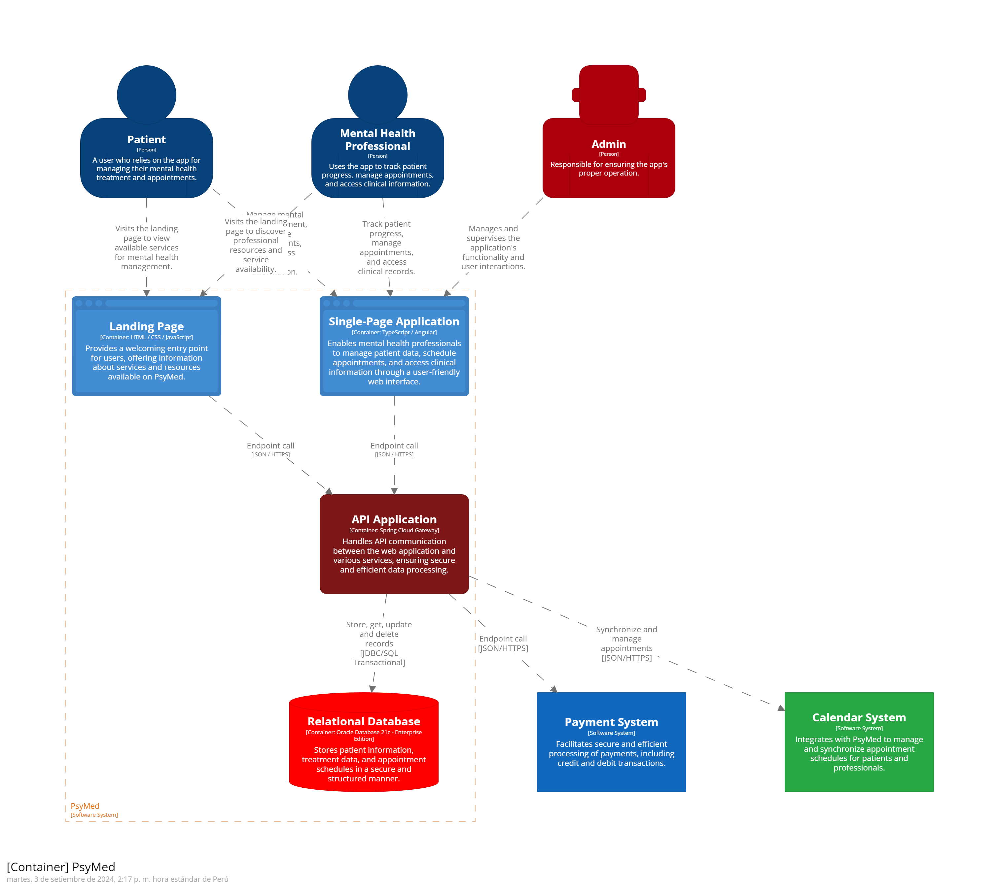

# Capítulo IV: Solution Software Design

## 4.1. Strategic-Level Domain-Driven Design
### 4.1.1. EventStorming
### 4.1.1.1. Candidate Context Discovery

#### Contextos Candidatos Identificados

| **Contexto Candidato**              | **Descripción**                                                                                      |
|-------------------------------------|------------------------------------------------------------------------------------------------------|
| **Gestión de Pacientes**            | Registro y seguimiento de pacientes, incluyendo funciones biológicas y estado emocional.             |
| **Gestión de Sesiones Clínicas**    | Programación y seguimiento de sesiones, incluyendo notas clínicas, diagnósticos y medicamentos.      |
| **Gestión de Citas y Recordatorios**| Administración de citas entre pacientes y profesionales, notificaciones automáticas.                 |
| **Colaboración Multidisciplinaria** | Compartir información clínica entre profesionales para tratamientos conjuntos.                       |
| **Gestión Administrativa**          | Generación de reportes, facturación, acceso a estadísticas, cumplimiento normativo.                  |
| **Portal del Paciente**             | Acceso a historial clínico, seguimiento de citas, encuestas de satisfacción, comunicación con el profesional. |

#### Justificación de la Segmentación

- **Gestión de Pacientes**: Centraliza toda la información relevante del paciente, fundamental para cualquier acción médica.
- **Gestión de Sesiones Clínicas**: Se enfoca en el detalle de cada interacción profesional-paciente, lo cual requiere un manejo específico.
- **Gestión de Citas y Recordatorios**: Por la alta frecuencia y necesidad de automatización, merece su propio contexto independiente.
- **Colaboración Multidisciplinaria**: Las instituciones requieren una plataforma que permita trabajo conjunto entre varios profesionales.
- **Gestión Administrativa**: Las tareas administrativas son distintas del manejo clínico, por lo que deben ser separadas.
- **Portal del Paciente**: El acceso del paciente es controlado y tiene necesidades específicas que requieren aislamiento del backend profesional.

### 4.1.1.2. Domain Message Flows Modeling

### Comandos y Eventos del Dominio

| **Comando**                          | **Evento Resultante**                             | **Contexto Productor**            | **Contexto Consumidor**                |
|--------------------------------------|---------------------------------------------------|-----------------------------------|----------------------------------------|
| Registrar Paciente                   | Paciente Registrado                               | Portal del Paciente                | Gestión de Pacientes                   |
| Agendar Cita                         | Cita Programada, Notificación Enviada             | Portal del Paciente / Profesional  | Gestión de Citas y Recordatorios       |
| Registrar Nota Clínica               | Nota Clínica Guardada, Diagnóstico Emitido        | Gestión de Sesiones Clínicas       | Gestión de Pacientes                   |
| Actualizar Funciones Biológicas      | Funciones Biológicas Actualizadas                 | Portal del Paciente                | Gestión de Pacientes                   |
| Compartir Diagnóstico                | Diagnóstico Compartido                           | Gestión de Sesiones Clínicas       | Colaboración Multidisciplinaria        |
| Generar Reporte Clínico              | Reporte Clínico Generado                         | Gestión de Pacientes / Administrativa | Gestión Administrativa              |
| Programar Reunión Multidisciplinaria | Reunión Agendada                                 | Colaboración Multidisciplinaria    | Gestión de Citas y Recordatorios       |

### Flujo de Eventos Clave

1. **Paciente se registra** a través del portal → Se emite **Paciente Registrado** → Se crea un historial en **Gestión de Pacientes**.
2. **Paciente agenda una cita** → Se emite **Cita Programada**, **Notificación Enviada** → Se coordina con **Gestión de Citas**.
3. **Profesional realiza una sesión** → Registra una **Nota Clínica**, genera un **Diagnóstico Emitido** → Se actualiza el historial en **Gestión de Pacientes**.
4. **Profesionales colaboran** en un caso complejo → **Diagnóstico Compartido** → Coordinan en **Colaboración Multidisciplinaria**.
5. **Administración** genera un **Reporte Clínico** con datos de sesiones y citas.

### 4.1.1.3. Bounded Context Canvases

| **Contexto**                  | **Propósito**                                                                                         | **Responsabilidades**                                                                                                                                     | **Eventos**                                                                                     | **Interfaces**                                                                                         | **Relaciones**                                                                                                      |
|-------------------------------|--------------------------------------------------------------------------------------------------------|-----------------------------------------------------------------------------------------------------------------------------------------------------------|--------------------------------------------------------------------------------------------------|-------------------------------------------------------------------------------------------------------|---------------------------------------------------------------------------------------------------------------------|
| **Gestión de Pacientes**      | Centralizar y mantener actualizada la información médica de cada paciente.                            | - Registro de pacientes.  - Actualización del historial clínico.  - Seguimiento de funciones biológicas y estado emocional.                          | - Paciente Registrado.  - Historial Clínico Actualizado.  - Funciones Biológicas Actualizadas. | - API REST `/pacientes`.  - Integración con Portal del Paciente.                                                 | Supplier de Sesiones Clínicas.  Customer de Portal del Paciente.  Partnership con Gestión Administrativa.     |
| **Gestión de Citas**          | Gestionar eficientemente la programación de citas, con notificaciones automáticas.                     | - Crear, modificar y cancelar citas.  - Generar notificaciones y recordatorios.                                                                         | - Cita Programada.  - Notificación Enviada.  - Cita Cancelada.                           | - API REST `/citas`.  - Calendario para profesionales y pacientes.                                               | Customer de Portal del Paciente.  Partnership con Colaboración Multidisciplinaria.  Supplier de Gestión Administrativa. |
| **Sesiones Clínicas**         | Documentar la interacción clínica, generando diagnósticos y notas.                                     | - Registro de notas clínicas.  - Generación de diagnósticos.  - Actualización de tratamientos.                                                       | - Nota Clínica Guardada.  - Diagnóstico Emitido.                                             | - API REST `/sesiones`.  - Acceso al historial clínico.                                                          | Supplier de Gestión de Pacientes.  Partnership con Colaboración Multidisciplinaria.                             |
| **Colaboración Multidisciplinaria** | Permitir la coordinación de varios profesionales en tratamientos compartidos.                      | - Compartir notas y diagnósticos.  - Coordinar reuniones clínicas.                                                                                      | - Diagnóstico Compartido.  - Reunión Agendada.                                               | - API REST `/colaboracion`.  - Herramienta colaborativa interna.                                                 | Partnership con Sesiones Clínicas.  Customer de Gestión de Citas.                                                |
| **Portal del Paciente**       | Brindar acceso al paciente para gestionar su atención médica y comunicación con profesionales.         | - Solicitar y gestionar citas.  - Visualizar historial clínico.  - Enviar actualizaciones emocionales y biológicas.                                 | - Solicitud de Cita.  - Datos Biológicos Actualizados.                                        | - Web/App.  - API REST `/portal-paciente`.                                                                      | Customer de Gestión de Pacientes.  Customer de Gestión de Citas.                                                 |
| **Gestión Administrativa**    | Control y supervisión administrativa: reportes, facturación y cumplimiento normativo.                  | - Generar reportes.  - Facturación y pagos.  - Cumplimiento de normativas.                                                                           | - Reporte Generado.  - Factura Emitida.                                                       | - API REST `/admin`.  - Dashboard Administrativo.                                                                | Partnership con todos los contextos.                                                                                |

### 4.1.2. Context Mapping

### 4.1.3. Software Architecture
- 4.1.3.1. Software Architecture Context Level Diagrams

- 4.1.3.2. Software Architecture Container Level Diagrams

- 4.1.3.3. Software Architecture Deployment Diagrams

## 4.2. Tactical-Level Domain-Driven Design
### 4.2.X. Bounded Context: `<Bounded Context Name>`
- 4.2.X.1. Domain Layer
  
- 4.2.X.2. Interface Layer
- 4.2.X.3. Application Layer
- 4.2.X.4. Infrastructure Layer
- 4.2.X.5. Bounded Context Software Architecture Component Level Diagrams
- 4.2.X.6. Bounded Context Software Architecture Code Level Diagrams
  - 4.2.X.6.1. Bounded Context Domain Layer Class Diagrams
  - 4.2.X.6.2. Bounded Context Database Design Diagram
