# Capítulo VI: Product Implementation, Validation & Deployment
## 6.1. Software Configuration Management.
### 6.1.1. Software Development Environment Configuration

Durante el desarrollo del proyecto móvil **Psymed**, se configuró un entorno de desarrollo distribuido y especializado, acorde a las necesidades de cada componente del sistema: aplicación móvil, backend, frontend web y documentación.

Para el desarrollo del sistema, se emplearon las siguientes herramientas:

- **Android Studio**: utilizado como entorno principal para la construcción y prueba de la aplicación móvil, permitiendo emulación de dispositivos Android y acceso a herramientas de depuración específicas para entornos móviles.
- **Rider (JetBrains)**: IDE elegido para el desarrollo del backend del sistema, ya que el proyecto utilizó el lenguaje **C#** y tecnologías compatibles con el ecosistema .NET.
- **Visual Studio Code**: empleado para el desarrollo del frontend (Landing Page) y la edición general del código, gracias a su flexibilidad y amplia compatibilidad con tecnologías como HTML, CSS y JavaScript.
- **WebStorm**: usado en la elaboración y mantenimiento del informe técnico, permitiendo una organización eficiente de archivos Markdown, edición colaborativa y navegación estructurada del contenido.

El entorno técnico integró servicios desarrollados en **C#** para el backend. El equipo utilizó **emuladores Android** para pruebas móviles, así como dispositivos físicos para validar la experiencia real del usuario.

Adicionalmente, todas las herramientas fueron integradas con **Git y GitHub** como sistema de control de versiones, facilitando el trabajo colaborativo entre miembros del equipo, el seguimiento de avances por ramas, y la documentación de cambios mediante *commits* semánticos.
### 6.1.2. Source Code Management.
La gestión del código fuente del proyecto **Psymed** se llevó a cabo utilizando **Git** como sistema de control de versiones distribuido, y **GitHub** como plataforma de colaboración remota.

El flujo de trabajo adoptado se basó en una estrategia de ramificación estructurada, con las siguientes ramas principales:

- `main`: rama principal y estable, destinada a contener las versiones listas para despliegue o revisión.
- `develop`: rama de integración, donde se consolidan las funcionalidades en desarrollo.
- `feature/*`: ramas dedicadas a cada funcionalidad o módulo, nombradas según el componente en el que se trabaja, como `feature/login`, `feature/test-psicologico`, `CHAPTER6`, entre otras.

El desarrollo de la aplicación web se llevó a cabo principalmente desde **Android Studio**, utilizando el lenguaje **Kotlin**, lo cual permitió generar una experiencia optimizada para dispositivos móviles con estructura web progresiva.

Cada rama de funcionalidad se integró mediante *pull requests* hacia `develop`, previa revisión de código. Esto aseguró control de calidad y redujo riesgos de conflictos o errores. Se aplicó una convención semántica en los mensajes de *commit*, empleando prefijos como:

- `feat:` para nuevas funcionalidades.
- `fix:` para corrección de errores.
- `docs:` para cambios en documentación.
- `refactor:` para reestructuración interna sin modificar el comportamiento.

El equipo utilizó además herramientas de GitHub como *issues* para el registro de tareas y errores, y *projects* para organizar el flujo de trabajo colaborativo.

Gracias a esta estructura de gestión del código fuente, se logró un desarrollo ordenado, seguro y fácilmente escalable para futuras versiones del sistema Psymed.

### 6.1.3. Source Code Style Guide & Conventions.

Durante el desarrollo del sistema Psymed, el equipo adoptó convenciones de codificación y estilo con el objetivo de garantizar la claridad, coherencia y mantenibilidad del código en todos los módulos del sistema.

#### Estilo en Backend (C# / ASP.NET Core)

Para el backend, desarrollado con C# en el entorno de JetBrains Rider, se aplicaron las convenciones estándar del ecosistema .NET, incluyendo:

- Uso de **PascalCase** para clases, métodos y propiedades.
- Uso de **camelCase** para variables locales y parámetros de métodos.
- Separación clara por **capas y responsabilidades**: `Domain`, `Application`, `Infrastructure`, `Shared`.
- Aplicación del **principio de inyección de dependencias** en los servicios y controladores.
- Organización de funcionalidades por módulos (por ejemplo, Medication, Profiles, IAM), favoreciendo el aislamiento de responsabilidades.

Asimismo, se priorizó la escritura de código limpio, evitando la duplicación y utilizando principios SOLID para la arquitectura orientada a objetos.

#### Estilo en Frontend Web (Landing Page)

El código de la Landing Page, desarrollado con HTML, CSS y JavaScript puro, se estructuró de forma semántica y legible:

- Uso de nombres de clases descriptivos, siguiendo convenciones como BEM en caso necesario.
- Separación del contenido (HTML), presentación (CSS) y comportamiento (JS).
- Organización de archivos en carpetas según su función: estilos, scripts, recursos.

Se priorizó la accesibilidad, el diseño responsive y una experiencia de usuario clara y rápida.

#### Estilo en App Móvil (Kotlin)

En el desarrollo móvil con Kotlin desde Android Studio, se siguieron las convenciones oficiales de estilo promovidas por JetBrains y Google:

- Nombrado en camelCase para variables y métodos.
- Clases y objetos definidos con PascalCase.

#### Documentación, Comentarios y Buenas Prácticas

- Se documentaron los métodos públicos y estructuras relevantes con comentarios descriptivos y útiles.
- Se evitaron comentarios redundantes, priorizando el uso de código autoexplicativo.
- Las funciones fueron diseñadas para ser pequeñas, reutilizables y centradas en una sola responsabilidad.
- Se utilizaron herramientas de limpieza y formateo automático en los distintos IDEs para mantener la consistencia del estilo.

En general, estas convenciones permitieron facilitar el trabajo colaborativo, la comprensión del código entre integrantes del equipo, y la escalabilidad del sistema Psymed.

### 6.1.4. Software Deployment Configuration.
El proceso de despliegue del sistema **Psymed** se abordó en dos partes: el frontend (Landing Page informativa) y el backend (servicios en C#, actualmente en desarrollo).

#### Despliegue del Frontend (Landing Page en Netlify)

La Landing Page fue desarrollada con tecnologías web estándar: **HTML5**, **CSS3** y **JavaScript puro**, sin frameworks adicionales. Su función principal es brindar una presentación informativa del sistema Psymed y redirigir al usuario a los servicios principales.

El despliegue se realizó en **Netlify**, una plataforma moderna que permite publicar sitios estáticos con facilidad. El procedimiento fue el siguiente:

1. El contenido final fue subido a un repositorio en GitHub.
2. Se enlazó el repositorio a Netlify, configurando la rama `develop` como fuente de despliegue automático.
3. Netlify detectó los archivos estáticos y ejecutó el flujo de `build` automáticamente.
4. El sitio quedó disponible con una URL pública generada por Netlify.

> **Figura 1.** Resumen del despliegue de la Landing Page en Netlify  
> 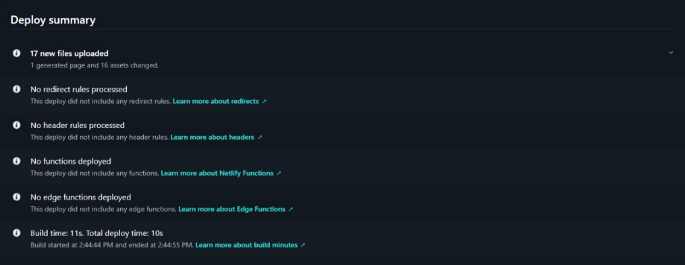

> **Figura 2.** Detalles del proceso de despliegue exitoso en Netlify  
> 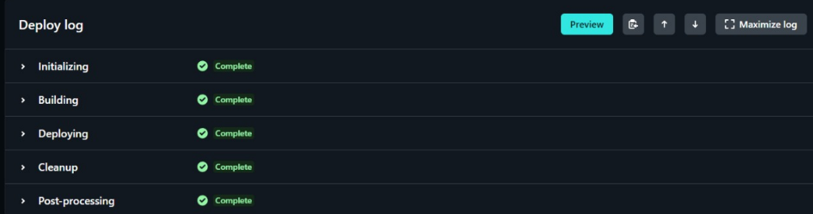

> **Figura 3.** Confirmación del despliegue publicado desde la rama `develop`  
> 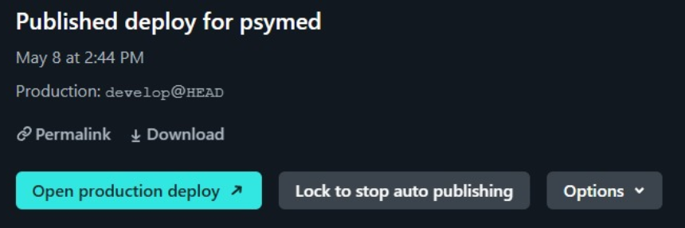

#### Despliegue del Backend (API en C# con Render)

El backend fue construido con **C# (ASP.NET Core)** y desplegado como API web mediante la plataforma **Render.com**, ideal para servicios modernos con despliegue automatizado.

El proceso consistió en:

- Subida del proyecto al repositorio `Psymed_Backend`.
- Creación de un nuevo servicio web en Render, enlazando directamente el repositorio.
- Configuración del entorno .NET Core, el comando de build (`dotnet build`) y ejecución (`dotnet run`).
- Render expuso automáticamente la API en el puerto `8080` y generó una URL pública:  
  `https://psymed-api.onrender.com`

El servicio fue desplegado con una instancia gratuita, por lo que Render puede aplicar suspensiones temporales tras periodos de inactividad, generando una breve demora al primer acceso.

> **Figura 2.** Despliegue del backend de Psymed utilizando Render.  
> 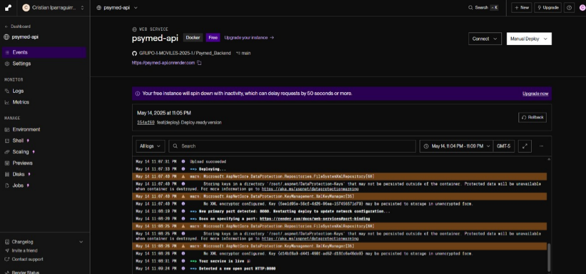

## 6.2. Landing Page, Services & Applications Implementation.
### 6.2.1. Sprint 1
#### 6.2.1.1. Sprint Planning 1
Para este primer sprint nos enfocaremos en los tasks para la elaboración de la Landing Page. Nos dividiremos entre nosotros cada una de las tareas identificadas para el sprint.

<table>
<tr>
    <th colspan="5">Sprint #</th>
    <th colspan="9">Sprint 1</th>
  </tr>
      <tr>
    <td colspan="13">Sprint Planning Background</td>
  </tr>
  <tr>
    <td colspan="5">Date</td>
    <td colspan="8">29/04/2025</td>
</tr>
  <tr>
    <td colspan="5">Time</td>
    <td colspan="8">6:00 PM</td>
  </tr>
  <tr>
    <td colspan="5">Location</td>
    <td colspan="8">Google Meet</td>
</tr>
<tr>
    <td colspan="5">Prepared By</td>
    <td colspan="8">Cristian Iparraguirre</td>
</tr>
<tr>
    <td colspan="5">Attendees (to planning meeting)</td>
    <td colspan="8">Cristian Iparraguirre, Francisco Hurtado, Jose Riega, George Galvan, Renato Reyes, Jhon Guerrero</td>
</tr>
<tr>
    <td colspan="5">Sprint n – 1 Review Summary</td>
    <td colspan="8">En esta primera sección se planificó el desarrollo de la Landing Page de la aplicación móvil PsyMed, orientada a presentar visualmente el objetivo del proyecto y facilitar el primer contacto del usuario con la app.</td>
</tr>
<tr>
    <td colspan="5">Sprint n – 1 Retrospective Summary</td>
    <td colspan="8">Los integrantes mencionaron como reto principal el diseño responsive con enfoque mobile-first utilizando HTML y CSS. Sin embargo, destacaron una mejora general en el trabajo en equipo y organización.</td>
</tr>
<tr>
    <td colspan="13">Sprint Goal & User Stories</td>
</tr>
<tr>
    <td colspan="5">Sprint n Goal</td>
    <td colspan="8">Finalizar el diseño e implementación de la Landing Page mobile-first de PsyMed</td>
</tr>
<tr>
    <td colspan="5">Sprint n Velocity</td>
    <td colspan="8">4 Story Points</td>
</tr>
<tr>
    <td colspan="5">Sum of Story Points</td>
    <td colspan="8">4 Story Points</td>
</tr>
</table>

#### 6.2.1.2. Sprint Backlog 1.
<table>
<tr>
    <th colspan="3">Sprint #</th>
    <th colspan="10">Sprint 1</th>
</tr>
<tr>
    <td colspan="3">User Story</td>
    <td colspan="10">Work-Item/Task</td>
</tr>
<tr>
    <td colspan="1">Id</td>
    <td colspan="2">Title</td>
    <td colspan="1">Id</td>
    <td colspan="2">Title</td>
    <td colspan="3">Description</td>
    <td colspan="1">Estimation</td>
    <td colspan="2">Assigned To</td>
    <td colspan="1">Status</td>
</tr>

<!-- ÉPICA 1: Accesibilidad de la Landing Page -->
<tr>
    <td colspan="13"><strong>Épica 1: Accesibilidad de la Landing Page</strong></td>
</tr>
<tr>
    <td>US01</td>
    <td colspan="2">Adaptabilidad y compatibilidad de la Landing Page</td>
    <td>1</td>
    <td colspan="2">Diseño mobile-first responsive</td>
    <td colspan="3">Aplicar diseño adaptable a diferentes dispositivos con HTML y CSS.</td>
    <td>2</td>
    <td colspan="2">George, Jose</td>
    <td>Done</td>
</tr>
<tr>
    <td>US02</td>
    <td colspan="2">Información clara del propósito de la app</td>
    <td>2</td>
    <td colspan="2">Redactar y estructurar contenido informativo</td>
    <td colspan="3">Mostrar claramente la finalidad de PsyMed para el usuario nuevo.</td>
    <td>1</td>
    <td colspan="2">Cristian, Francisco</td>
    <td>Done</td>
</tr>
<tr>
    <td>US03</td>
    <td colspan="2">Acceso a soporte técnico</td>
    <td>3</td>
    <td colspan="2">Incluir enlace de contacto o soporte</td>
    <td colspan="3">Facilitar al usuario la forma de contactar soporte desde la Landing Page.</td>
    <td>1</td>
    <td colspan="2">Renato</td>
    <td>Done</td>
</tr>

<!-- ÉPICA 2: Interfaz de la Landing Page -->
<tr>
    <td colspan="13"><strong>Épica 2: Interfaz de la Landing Page</strong></td>
</tr>
<tr>
    <td>US04</td>
    <td colspan="2">Visualización de imágenes y gráficos</td>
    <td>4</td>
    <td colspan="2">Insertar recursos visuales atractivos</td>
    <td colspan="3">Diseñar y agregar gráficos que refuercen el mensaje visual.</td>
    <td>1</td>
    <td colspan="2">Jhon, George</td>
    <td>Done</td>
</tr>
<tr>
    <td>US05</td>
    <td colspan="2">Tipografía cómoda y agradable</td>
    <td>5</td>
    <td colspan="2">Aplicar estilos tipográficos legibles</td>
    <td colspan="3">Elegir fuente, tamaño y color para una lectura amigable.</td>
    <td>1</td>
    <td colspan="2">Francisco</td>
    <td>Done</td>
</tr>
<tr>
    <td>US06</td>
    <td colspan="2">Diseño moderno y atractivo</td>
    <td>6</td>
    <td colspan="2">Aplicar estilo visual coherente y profesional</td>
    <td colspan="3">Uso de colores, espaciado y estética general para captar atención.</td>
    <td>1</td>
    <td colspan="2">Cristian, Renato</td>
    <td>Done</td>
</tr>
<tr>
    <td>US07</td>
    <td colspan="2">Interactividad en la navegación</td>
    <td>7</td>
    <td colspan="2">Agregar animaciones y efecto hover</td>
    <td colspan="3">Mejorar la experiencia del usuario con interacciones visuales.</td>
    <td>1</td>
    <td colspan="2">Jose, Jhon</td>
    <td>Done</td>
</tr>
</table>

#### 6.2.1.3. Development Evidence for Sprint Review.
<table>
  <tr>
    <th colspan="2">Repository</th> <th colspan="2">Branch</th>
    <th colspan="2">Commit Id</th> <th colspan="2">Commit Message</th>
    <th colspan="2">Commit Message Body</th>
    <th colspan="2">Commited on (Date)</th>
  </tr>
  <tr>
    <td colspan="2">Psymed-LandingPage</td>
    <td colspan="2">main</td> <td colspan="2">a1b2c3d</td>
    <td colspan="2">chore: initial project structure</td>
    <td colspan="2">Setup del entorno inicial para la Landing Page</td>
    <td colspan="2">04/05/2025</td>
  </tr>
  <tr>
    <td colspan="2">Psymed-LandingPage</td>
    <td colspan="2">main</td> <td colspan="2">d4e5f6g</td>
    <td colspan="2">feat: responsive hero section</td>
    <td colspan="2">
      Creación de sección principal con diseño adaptativo para US01
    </td>
    <td colspan="2">05/05/2025</td>
  </tr>
  <tr>
    <td colspan="2">Psymed-LandingPage</td>
    <td colspan="2">main</td> <td colspan="2">h7i8j9k</td>
    <td colspan="2">feat: sección propósito de la aplicación</td>
    <td colspan="2">Sección explicando el objetivo del sistema (US02)</td>
    <td colspan="2">06/05/2025</td>
  </tr>
  <tr>
    <td colspan="2">Psymed-LandingPage</td>
    <td colspan="2">main</td> <td colspan="2">l0m1n2o</td>
    <td colspan="2">feat: sección de soporte técnico</td>
    <td colspan="2">Sección de contacto y ayuda para visitantes (US03)</td>
    <td colspan="2">05/05/2025</td>
  </tr>
  <tr>
    <td colspan="2">Psymed-LandingPage</td>
    <td colspan="2">main</td> <td colspan="2">p3q4r5s</td>
    <td colspan="2">style: actualización de tipografía y colores</td>
    <td colspan="2">
      Implementación de estilos visuales y tipografía clara (US05)
    </td>
    <td colspan="2">06/05/2025</td>
  </tr>
  <tr>
    <td colspan="2">Psymed-LandingPage</td>
    <td colspan="2">main</td> <td colspan="2">t6u7v8w</td>
    <td colspan="2">feat: integración de imágenes y gráficos</td>
    <td colspan="2">
      Inclusión de gráficos relevantes e imágenes llamativas (US04)
    </td>
    <td colspan="2">04/05/2025</td>
  </tr>
  <tr>
    <td colspan="2">Psymed-LandingPage</td>
    <td colspan="2">main</td> <td colspan="2">x9y0z1a</td>
    <td colspan="2">feat: diseño atractivo general</td>
    <td colspan="2">
      Aplicación de diseño moderno a toda la Landing Page (US06)
    </td>
    <td colspan="2">01/05/2025</td>
  </tr>
  <tr>
    <td colspan="2">Psymed-LandingPage</td>
    <td colspan="2">main</td> <td colspan="2">b2c3d4e</td>
    <td colspan="2">feat: interactividad en navegación</td>
    <td colspan="2">
      Agregado de transiciones y animaciones para una navegación fluida (US07)
    </td>
    <td colspan="2">06/05/2025</td>
  </tr>
</table>

#### 6.2.1.4. Execution Evidence for Sprint Review.
Para este primer entregable, hemos elaborado la Landing Page del proyecto de "PsyMed". De tal modo, se podrá visualizar la información relevante sobre nuestra plataforma.

**Sección de Inicio**: Se implementó el Header y la página principal de nuestra Landing Page.

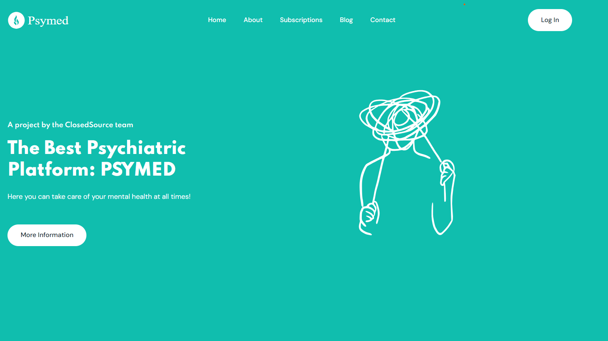

**Sección de Aplicación**: Se implementó la sección de la aplicación detallando el propósito de la misma.

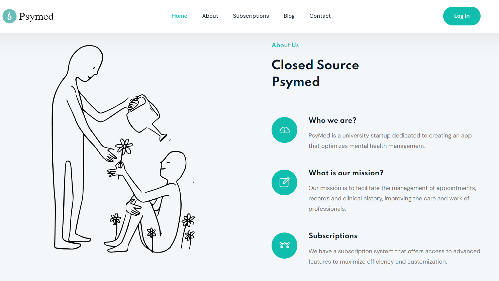

**Sección de Servicios**: Se implementó la sección de los servicios ofrecidos.

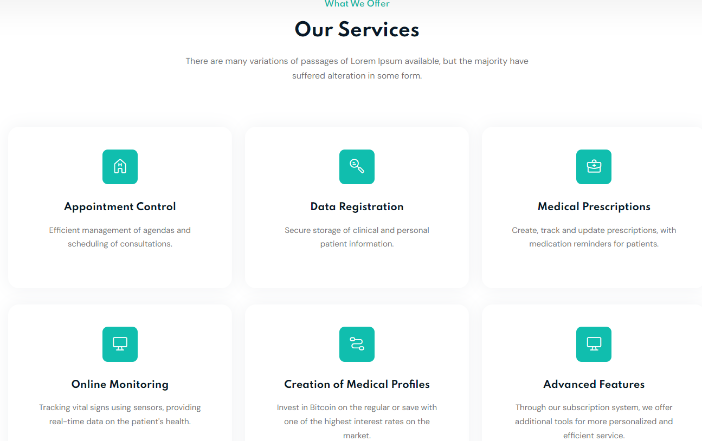

**Sección de Planes**: Se implementó la sección de ver los tipos de suscripción.

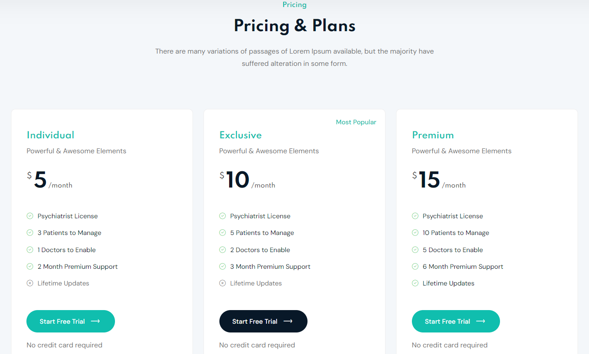

**Sección de Creadores**: Se añadió la sección de información sobre los desarrolladores de la plataforma.

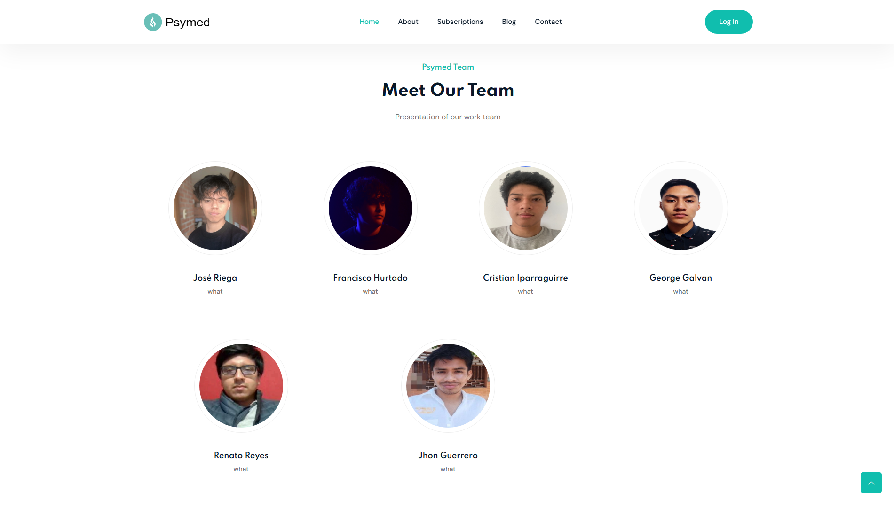

**Sección de About the Team**: Se implementó la sección del About the Team

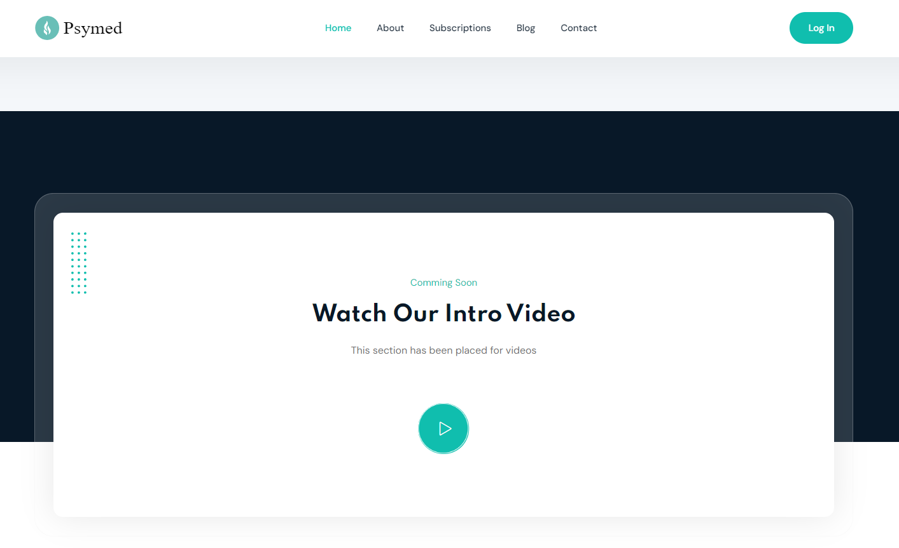

#### 6.2.1.5. Services Documentation Evidence for Sprint Review.
Durante este Sprint se avanzó en la documentación de los servicios relacionados a la funcionalidad de la Landing Page, así como los primeros servicios de autenticación. La documentación se elaboró utilizando **OpenAPI (Swagger)** y refleja los endpoints implementados para el inicio de sesión, registro y recuperación de contraseña, lo cual permite una base clara para los desarrolladores frontend y testers.

A continuación se detalla la tabla de endpoints documentados hasta el momento:

<table>
<tr>
    <th>Endpoint</th>
    <th>HTTP Verb</th>
    <th>Description</th>
    <th>Request Syntax</th>
    <th>Parameters</th>
    <th>Example Response</th>
    <th>Documentation URL</th>
</tr>

<tr>
    <td>/api/auth/register</td>
    <td>POST</td>
    <td>Permite a un profesional o paciente registrarse en el sistema.</td>
    <td>POST /api/auth/register</td>
    <td>
        - `name`: string 
        - `email`: string 
        - `password`: string 
        - `role`: string (patient | professional)
    </td>
    <td>
        {
          "message": "Usuario registrado exitosamente",
          "userId": "abc123"
        }
    </td>
    <td>http://localhost:3000/api-docs</td>
</tr>

<tr>
    <td>/api/auth/login</td>
    <td>POST</td>
    <td>Permite iniciar sesión a pacientes o profesionales.</td>
    <td>POST /api/auth/login</td>
    <td>
        - `email`: string 
        - `password`: string
    </td>
    <td>
        {
          "token": "eyJhbGciOiJIUzI1NiIsInR5cCI6IkpXVCJ9...",
          "role": "patient"
        }
    </td>
    <td>http://localhost:3000/api-docs</td>
</tr>

<tr>
    <td>/api/auth/recover-password</td>
    <td>POST</td>
    <td>Envía un correo de recuperación al usuario.</td>
    <td>POST /api/auth/recover-password</td>
    <td>
        - `email`: string
    </td>
    <td>
        {
          "message": "Se ha enviado un enlace de recuperación al correo electrónico"
        }
    </td>
    <td>http://localhost:3000/api-docs</td>
</tr>

</table>

#### 6.2.1.6. Software Deployment Evidence for Sprint Review.
**Evidencias del deploy:** 

Evidencia:

  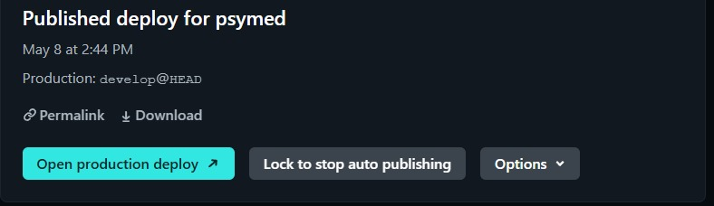

Evidencias del deploy:

  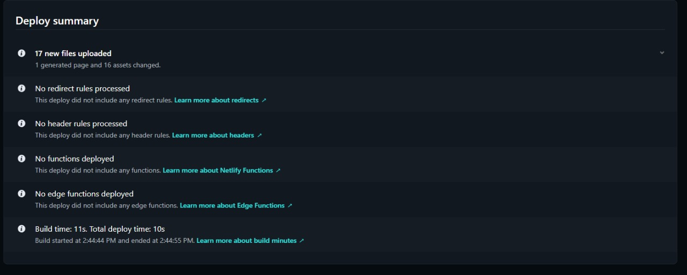

Evidencias deL link:

  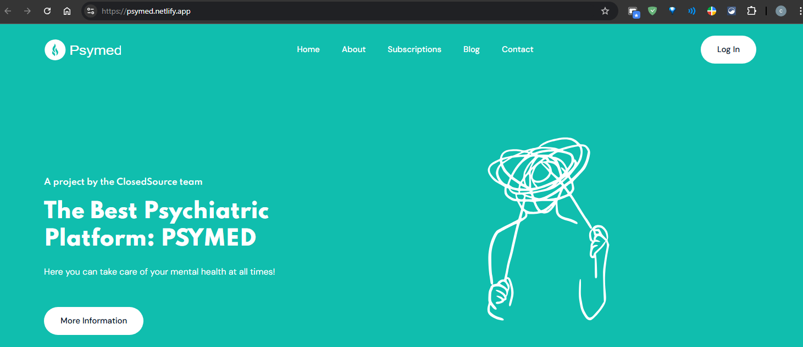

#### 6.2.1.7. Team Collaboration Insights during Sprint.
A continuación todos los analíticos que nos proporciona Github, en su apartado de Insights, sobre la colaboración del equipo durante el Sprint

  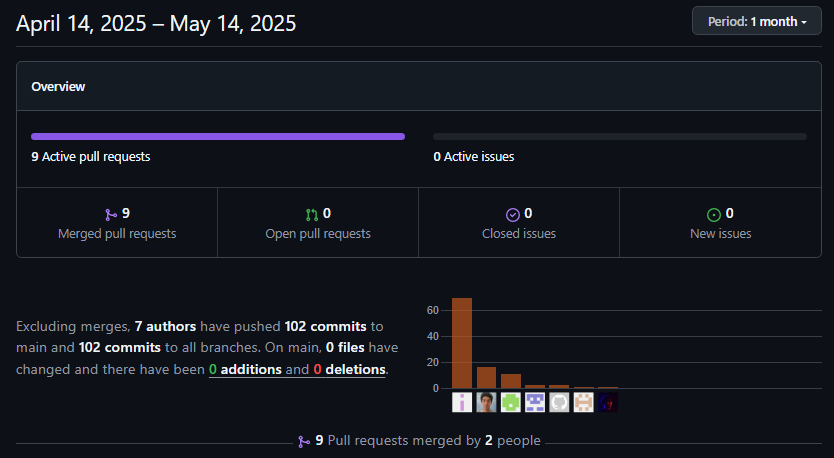

  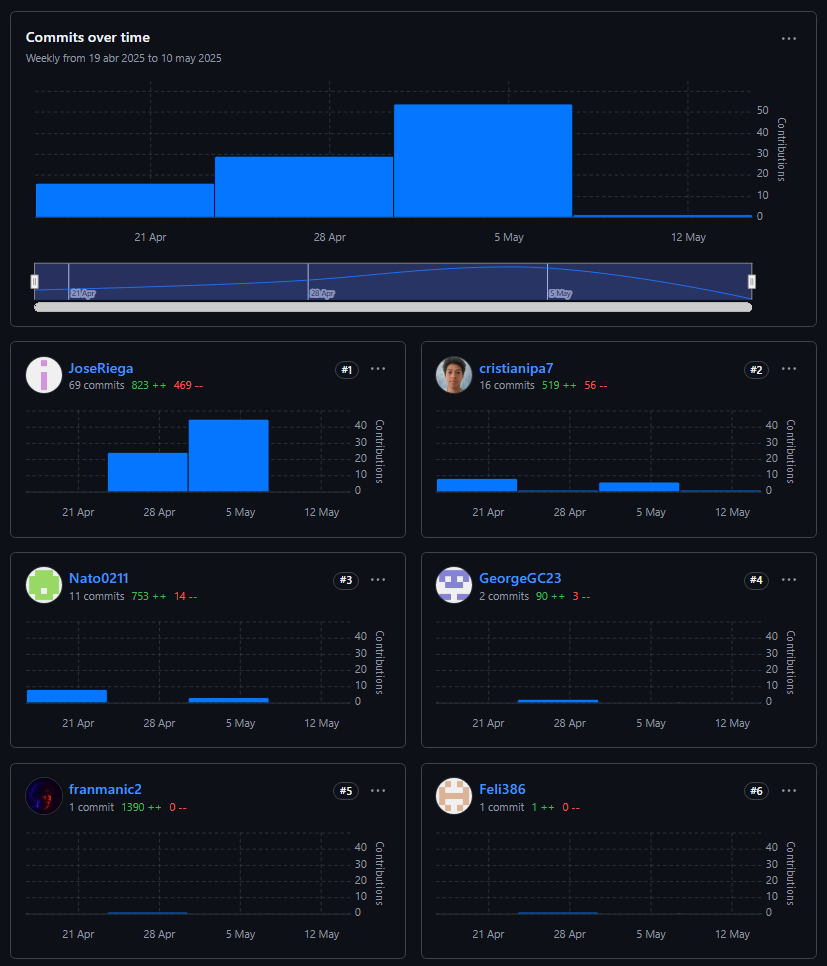

### 6.2.2 Sprint 2
#### 6.2.2.1. Sprint Planning 2
Para este primer sprint nos enfocaremos en los tasks para la elaboración de la Landing Page. Nos dividiremos entre nosotros cada una de las tareas identificadas para el sprint.

<table>
<tr>
    <th colspan="5">Sprint #</th>
    <th colspan="9">Sprint 2</th>
  </tr>
      <tr>
    <td colspan="13">Sprint Planning Background</td>
  </tr>
  <tr>
    <td colspan="5">Date</td>
    <td colspan="8">20/05/2025</td>
</tr>
  <tr>
    <td colspan="5">Time</td>
    <td colspan="8">6:00 PM</td>
  </tr>
  <tr>
    <td colspan="5">Location</td>
    <td colspan="8">Google Meet</td>
</tr>
<tr>
    <td colspan="5">Prepared By</td>
    <td colspan="8">Cristian Iparraguirre</td>
</tr>
<tr>
    <td colspan="5">Attendees (to planning meeting)</td>
    <td colspan="8">Cristian Iparraguirre, Francisco Hurtado, Jose Riega, George Galvan, Renato Reyes, Jhon Guerrero</td>
</tr>
<tr>
    <td colspan="5">Sprint n – 2 Review Summary</td>
    <td colspan="8">En esta segunda sección se planificó el desarrollo de la aplicación móvil PsyMed, </td>
</tr>
<tr>
    <td colspan="5">Sprint n – 2 Retrospective Summary</td>
    <td colspan="8">Los particimantes mencionaron que uno de los retos principales seria integrar las funcionalidades una vez se tengan las vistas hechas.</td>
</tr>
<tr>
    <td colspan="13">Sprint Goal & User Stories</td>
</tr>
<tr>
    <td colspan="5">Sprint n Goal</td>
    <td colspan="8">Finalizar el diseño e implementación de la Landing Page mobile-first de PsyMed</td>
</tr>
<tr>
    <td colspan="5">Sprint n Velocity</td>
    <td colspan="8">4 Story Points</td>
</tr>
<tr>
    <td colspan="5">Sum of Story Points</td>
    <td colspan="8">4 Story Points</td>
</tr>
</table>

#### 6.2.2.2. Sprint Backlog 2.
<table>
<tr>
    <th colspan="3">Sprint #</th>
    <th colspan="10">Sprint 2</th>
</tr>
<tr>
    <td colspan="3">User Story</td>
    <td colspan="10">Work-Item/Task</td>
</tr>
<tr>
    <td colspan="1">Id</td>
    <td colspan="2">Title</td>
    <td colspan="1">Id</td>
    <td colspan="2">Title</td>
    <td colspan="3">Description</td>
    <td colspan="1">Estimation</td>
    <td colspan="2">Assigned To</td>
    <td colspan="1">Status</td>
</tr>

<!-- ÉPICA 1: Accesibilidad de la Landing Page -->
<tr>
    <td colspan="13"><strong>Épica 3: Acceso a la aplicación</strong></td>
</tr>
<tr>
    <td>US08</td>
    <td colspan="2">Registro como profesional de la salud mental</td>
    <td>1</td>
    <td colspan="2">Diseño mobile-first responsive</td>
    <td colspan="3">Como profesional de la salud mental, quiero registrarme con mis credenciales para acceder a las funcionalidades específicas y gestionar la información de mis pacientes..</td>
    <td>2</td>
    <td colspan="2">George, Jose</td>
    <td>Done</td>
</tr>
<tr>
    <td>US09</td>
    <td colspan="2">Inicio de sesión como paciente</td>
    <td>2</td>
    <td colspan="2">Redactar y estructurar contenido informativo</td>
    <td colspan="3">Como paciente, quiero iniciar sesión en la plataforma para acceder a mi información personal y seguimiento de tratamiento..</td>
    <td>1</td>
    <td colspan="2">Cristian, Francisco</td>
    <td>Done</td>
</tr>
<tr>
    <td>US10</td>
    <td colspan="2">Inicio de sesión como profesional de la salud mental</td>
    <td>3</td>
    <td colspan="2">Incluir enlace de contacto o soporte</td>
    <td colspan="3">Como profesional de la salud mental, quiero iniciar sesión para gestionar la información de mis pacientes y acceder a herramientas de seguimiento.</td>
    <td>1</td>
    <td colspan="2">Renato</td>
    <td>Done</td>
</tr>

<!-- ÉPICA 2: Interfaz de la Landing Page -->
<tr>
    <td colspan="13"><strong>Épica 4: Registro de información del paciente</strong></td>
</tr>
<tr>
    <td>US13</td>
    <td colspan="2">Registro de información personal del paciente</td>
    <td>4</td>
    <td colspan="2">Insertar recursos visuales atractivos</td>
    <td colspan="3">Como profesional de la salud mental, quiero registrar la información personal del paciente para tener una referencia detallada y precisa..</td>
    <td>1</td>
    <td colspan="2">Jhon, George</td>
    <td>Done</td>
</tr>
<tr>
    <td>US14<td>
    <td colspan="2">Registro de medicamentos del paciente</td>
    <td>5</td>
    <td colspan="2">Aplicar estilos tipográficos legibles</td>
    <td colspan="3">Como profesional de la salud mental, quiero registrar los medicamentos del paciente para seguir adecuadamente su tratamiento farmacológico..</td>
    <td>1</td>
    <td colspan="2">Francisco</td>
    <td>Done</td>
</tr>
<tr>
    <td>US15</td>
    <td colspan="2">Registro de historial médico del paciente</td>
    <td>6</td>
    <td colspan="2">Aplicar estilo visual coherente y profesional</td>
    <td colspan="3">Como profesional de la salud mental, quiero registrar el historial médico del paciente para tener un contexto completo de sus antecedentes.</td>
    <td>1</td>
    <td colspan="2">Cristian, Renato</td>
    <td>Done</td>
</tr>
<tr>
    <td>US16</td>
    <td colspan="2">Registro Completo de Información Médica</td>
    <td>7</td>
    <td colspan="2">Agregar animaciones y efecto hover</td>
    <td colspan="3">Como profesional de la salud mental, quiero registrar toda la información médica relevante de mis pacientes para tener un historial completo para su tratamiento.</td>
    <td>1</td>
    <td colspan="2">Jose</td>
    <td>Done</td>
</tr>
</table>

#### 6.2.2.3. Development Evidence for Sprint Review.
<table>
  <tr>
    <th colspan="2">Repository</th> <th colspan="2">Branch</th>
    <th colspan="2">Commit Id</th> <th colspan="2">Commit Message</th>
    <th colspan="2">Commit Message Body</th>
    <th colspan="2">Commited on (Date)</th>
  </tr>
  <tr>
    <td colspan="2">PsyMed_MobileApplication_Flutter</td>
    <td colspan="2">main</td> <td colspan="2">1d2c012</td>
    <td colspan="2">Initial commit</td>
    <td colspan="2">creacion del repositorio</td>
    <td colspan="2">22/06/2025</td>
  </tr>
  <tr>
    <td colspan="2">PsyMed_MobileApplication_Fluttere</td>
    <td colspan="2">main</td> <td colspan="2">466ba6e</td>
    <td colspan="2">feat: created project in flutter and first views carga, login and register</td>
    <td colspan="2">
      Creaccion de la vista de carga, inicio de sesion y registro (US01)
    </td>
    <td colspan="2">22/06/2025</td>
  </tr>
  <tr>
    <td colspan="2">PsyMed_MobileApplication_Flutter</td>
    <td colspan="2">Implementation_IAM_endpoints</td> <td colspan="2">cdfa2fe</td>
    <td colspan="2">feat: added IAM funtion</td>
    <td colspan="2">creaccion de la funcion IAM</td>
    <td colspan="2">22/06/2025</td>
  </tr>
  <tr>
    <td colspan="2">PsyMed_MobileApplication_Flutter</td>
    <td colspan="2">Implementation_IAM_endpoints</td> <td colspan="2">b99d70d</td>
    <td colspan="2">feat: added sidebar</td>
    <td colspan="2">Creacion de la sidebar</td>
    <td colspan="2">22/06/2025</td>
  </tr>
  <tr>
    <td colspan="2">PsyMed_MobileApplication_Flutter</td>
    <td colspan="2">Implementation_Patient_Tasks</td> <td colspan="2">2377e0a</td>
    <td colspan="2">feat: added patient tasks views</td>
    <td colspan="2">
      Creacion de las vistas de tareas del paciente (US05)
    </td>
    <td colspan="2">22/06/2025</td>
  </tr>
  <tr>
    <td colspan="2">PsyMed_MobileApplication_Flutter</td>
    <td colspan="2">Implementation_Patient_Tasks</td> <td colspan="2">bd51264</td>
    <td colspan="2">refactor: changes in home_view for the new screens</td>
    <td colspan="2">
      Cambios en la vista de inicio para las nuevas pantallas (US04)
    </td>
    <td colspan="2">22/06/2025</td>
  </tr>
  <tr>
    <td colspan="2">PsyMed_MobileApplication_Flutter</td>
    <td colspan="2">Implementation_Patient_Tasks</td> <td colspan="2">cab0f41</td>
    <td colspan="2">feat: added button retroceso</td>
    <td colspan="2">
      Agregado de boton retroceso en las vistas 
    </td>
    <td colspan="2">22/06/2025</td>
  </tr>
</table>

#### 6.2.2.4. Execution Evidence for Sprint Review.

Para este primer entregable, hemos elaborado la Landing Page del proyecto de "PsyMed". De tal modo, se podrá visualizar la información relevante sobre nuestra plataforma.

**Inicio de sesion**: Se implementó el inicio de sesion.

**Registro**: Se implementó el registro.

**Menu**: Se implementó el menu.

**Sidebar**: Se implementó la sidebar.

**Sección de Pacientes**: Se añadió la sección de pacientes.

**Sección de Paciente**: Se implementó la sección informacion de un paciente en específico.

**Sección de Prescripción**: Se implementó la sección de prescripción.

**Sección de Edición**: Se implementó la sección de edición de un paciente.

**Sección de Preescripcion**: Se implementó la sección de edicion de preescripcion.

**Sección de Perfil**: Se implementó la sección de perfil.

**Sección de Estados de Ánimo**: Se implementó la sección de estados de ánimo.

**Sección de Configuración**: Se implementó la sección de configuración.

**Sección de Calendario**: Se implementó la sección de calendario.

**Sección de Añadir Paciente**: Se implementó la sección de añadir paciente.

**Sección de Añadir Medicación**: Se implementó la sección de añadir medicación.

#### 6.2.2.5. Services Documentation Evidence for Sprint Review.
Durante este Sprint se avanzó en la documentación de los servicios relacionados a la funcionalidad de la Landing Page, así como los primeros servicios de autenticación. La documentación se elaboró utilizando **OpenAPI (Swagger)** y refleja los endpoints implementados para el inicio de sesión, registro y recuperación de contraseña, lo cual permite una base clara para los desarrolladores frontend y testers.

A continuación se detalla la tabla de endpoints documentados hasta el momento:

<table>
<tr>
    <th>Endpoint</th>
    <th>HTTP Verb</th>
    <th>Description</th>
    <th>Request Syntax</th>
    <th>Parameters</th>
    <th>Example Response</th>
    <th>Documentation URL</th>
</tr>

<tr>
    <td>/api/auth/register</td>
    <td>POST</td>
    <td>Permite a un profesional o paciente registrarse en el sistema.</td>
    <td>POST /api/auth/register</td>
    <td>
        - `name`: string 
        - `email`: string 
        - `password`: string 
        - `role`: string (patient | professional)
    </td>
    <td>
        {
          "message": "Usuario registrado exitosamente",
          "userId": "abc123"
        }
    </td>
    <td>http://localhost:3000/api-docs</td>
</tr>

<tr>
    <td>/api/auth/login</td>
    <td>POST</td>
    <td>Permite iniciar sesión a pacientes o profesionales.</td>
    <td>POST /api/auth/login</td>
    <td>
        - `email`: string 
        - `password`: string
    </td>
    <td>
        {
          "token": "eyJhbGciOiJIUzI1NiIsInR5cCI6IkpXVCJ9...",
          "role": "patient"
        }
    </td>
    <td>http://localhost:3000/api-docs</td>
</tr>

<tr>
    <td>/api/auth/recover-password</td>
    <td>POST</td>
    <td>Envía un correo de recuperación al usuario.</td>
    <td>POST /api/auth/recover-password</td>
    <td>
        - `email`: string
    </td>
    <td>
        {
          "message": "Se ha enviado un enlace de recuperación al correo electrónico"
        }
    </td>
    <td>http://localhost:3000/api-docs</td>
</tr>

</table>

#### 6.2.2.6. Software Deployment Evidence for Sprint Review.
**Evidencias del deploy:** 

Todas las pruebas de despliegue se realizaron en el entorno de desarrollo, por lo que no se generó un despliegue público.

#### 6.2.2.7. Team Collaboration Insights during Sprint.
A continuación todos los analíticos que nos proporciona Github, en su apartado de Insights, sobre la colaboración del equipo durante el Sprint

  

  

