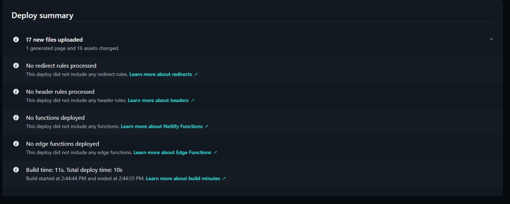

# Capítulo VI: Product Implementation, Validation & Deployment
## 6.1. Software Configuration Management.
### 6.1.1. Software Development Environment Configuration.
### 6.1.2. Source Code Management.
### 6.1.3. Source Code Style Guide & Conventions.
### 6.1.4. Software Deployment Configuration.
## 6.2. Landing Page, Services & Applications Implementation.
### 6.2.1. Sprint 1
#### 6.2.1.1. Sprint Planning 1
Para este primer sprint nos enfocaremos en los tasks para la elaboración de la Landing Page. Nos dividiremos entre nosotros cada una de las tareas identificadas para el sprint.

<table>
<tr>
    <th colspan="5">Sprint #</th>
    <th colspan="9">Sprint 1</th>
  </tr>
      <tr>
    <td colspan="13">Sprint Planning Background</td>
  </tr>
  <tr>
    <td colspan="5">Date</td>
    <td colspan="8">29/04/2025</td>
</tr>
  <tr>
    <td colspan="5">Time</td>
    <td colspan="8">6:00 PM</td>
  </tr>
  <tr>
    <td colspan="5">Location</td>
    <td colspan="8">Google Meet</td>
</tr>
<tr>
    <td colspan="5">Prepared By</td>
    <td colspan="8">Cristian Iparraguirre</td>
</tr>
<tr>
    <td colspan="5">Attendees (to planning meeting)</td>
    <td colspan="8">Cristian Iparraguirre, Francisco Hurtado, Jose Riega, George Galvan, Renato Reyes, Jhon Guerrero</td>
</tr>
<tr>
    <td colspan="5">Sprint n – 1 Review Summary</td>
    <td colspan="8">En esta primera sección se planificó el desarrollo de la Landing Page de la aplicación móvil PsyMed, orientada a presentar visualmente el objetivo del proyecto y facilitar el primer contacto del usuario con la app.</td>
</tr>
<tr>
    <td colspan="5">Sprint n – 1 Retrospective Summary</td>
    <td colspan="8">Los integrantes mencionaron como reto principal el diseño responsive con enfoque mobile-first utilizando HTML y CSS. Sin embargo, destacaron una mejora general en el trabajo en equipo y organización.</td>
</tr>
<tr>
    <td colspan="13">Sprint Goal & User Stories</td>
</tr>
<tr>
    <td colspan="5">Sprint n Goal</td>
    <td colspan="8">Finalizar el diseño e implementación de la Landing Page mobile-first de PsyMed</td>
</tr>
<tr>
    <td colspan="5">Sprint n Velocity</td>
    <td colspan="8">4 Story Points</td>
</tr>
<tr>
    <td colspan="5">Sum of Story Points</td>
    <td colspan="8">4 Story Points</td>
</tr>
</table>

#### 6.2.1.2. Sprint Backlog 1.
<table>
<tr>
    <th colspan="3">Sprint #</th>
    <th colspan="10">Sprint 1</th>
</tr>
<tr>
    <td colspan="3">User Story</td>
    <td colspan="10">Work-Item/Task</td>
</tr>
<tr>
    <td colspan="1">Id</td>
    <td colspan="2">Title</td>
    <td colspan="1">Id</td>
    <td colspan="2">Title</td>
    <td colspan="3">Description</td>
    <td colspan="1">Estimation</td>
    <td colspan="2">Assigned To</td>
    <td colspan="1">Status</td>
</tr>

<!-- ÉPICA 1: Accesibilidad de la Landing Page -->
<tr>
    <td colspan="13"><strong>Épica 1: Accesibilidad de la Landing Page</strong></td>
</tr>
<tr>
    <td>US01</td>
    <td colspan="2">Adaptabilidad y compatibilidad de la Landing Page</td>
    <td>1</td>
    <td colspan="2">Diseño mobile-first responsive</td>
    <td colspan="3">Aplicar diseño adaptable a diferentes dispositivos con HTML y CSS.</td>
    <td>2</td>
    <td colspan="2">George, Jose</td>
    <td>Done</td>
</tr>
<tr>
    <td>US02</td>
    <td colspan="2">Información clara del propósito de la app</td>
    <td>2</td>
    <td colspan="2">Redactar y estructurar contenido informativo</td>
    <td colspan="3">Mostrar claramente la finalidad de PsyMed para el usuario nuevo.</td>
    <td>1</td>
    <td colspan="2">Cristian, Francisco</td>
    <td>Done</td>
</tr>
<tr>
    <td>US03</td>
    <td colspan="2">Acceso a soporte técnico</td>
    <td>3</td>
    <td colspan="2">Incluir enlace de contacto o soporte</td>
    <td colspan="3">Facilitar al usuario la forma de contactar soporte desde la Landing Page.</td>
    <td>1</td>
    <td colspan="2">Renato</td>
    <td>Done</td>
</tr>

<!-- ÉPICA 2: Interfaz de la Landing Page -->
<tr>
    <td colspan="13"><strong>Épica 2: Interfaz de la Landing Page</strong></td>
</tr>
<tr>
    <td>US04</td>
    <td colspan="2">Visualización de imágenes y gráficos</td>
    <td>4</td>
    <td colspan="2">Insertar recursos visuales atractivos</td>
    <td colspan="3">Diseñar y agregar gráficos que refuercen el mensaje visual.</td>
    <td>1</td>
    <td colspan="2">Jhon, George</td>
    <td>Done</td>
</tr>
<tr>
    <td>US05</td>
    <td colspan="2">Tipografía cómoda y agradable</td>
    <td>5</td>
    <td colspan="2">Aplicar estilos tipográficos legibles</td>
    <td colspan="3">Elegir fuente, tamaño y color para una lectura amigable.</td>
    <td>1</td>
    <td colspan="2">Francisco</td>
    <td>Done</td>
</tr>
<tr>
    <td>US06</td>
    <td colspan="2">Diseño moderno y atractivo</td>
    <td>6</td>
    <td colspan="2">Aplicar estilo visual coherente y profesional</td>
    <td colspan="3">Uso de colores, espaciado y estética general para captar atención.</td>
    <td>1</td>
    <td colspan="2">Cristian, Renato</td>
    <td>Done</td>
</tr>
<tr>
    <td>US07</td>
    <td colspan="2">Interactividad en la navegación</td>
    <td>7</td>
    <td colspan="2">Agregar animaciones y efecto hover</td>
    <td colspan="3">Mejorar la experiencia del usuario con interacciones visuales.</td>
    <td>1</td>
    <td colspan="2">Jose, Jhon</td>
    <td>Done</td>
</tr>
</table>

#### 6.2.1.3. Development Evidence for Sprint Review.
<table>
  <tr>
    <th colspan="2">Repository</th> <th colspan="2">Branch</th>
    <th colspan="2">Commit Id</th> <th colspan="2">Commit Message</th>
    <th colspan="2">Commit Message Body</th>
    <th colspan="2">Commited on (Date)</th>
  </tr>
  <tr>
    <td colspan="2">Psymed-LandingPage</td>
    <td colspan="2">main</td> <td colspan="2">a1b2c3d</td>
    <td colspan="2">chore: initial project structure</td>
    <td colspan="2">Setup del entorno inicial para la Landing Page</td>
    <td colspan="2">04/05/2025</td>
  </tr>
  <tr>
    <td colspan="2">Psymed-LandingPage</td>
    <td colspan="2">main</td> <td colspan="2">d4e5f6g</td>
    <td colspan="2">feat: responsive hero section</td>
    <td colspan="2">
      Creación de sección principal con diseño adaptativo para US01
    </td>
    <td colspan="2">05/05/2025</td>
  </tr>
  <tr>
    <td colspan="2">Psymed-LandingPage</td>
    <td colspan="2">main</td> <td colspan="2">h7i8j9k</td>
    <td colspan="2">feat: sección propósito de la aplicación</td>
    <td colspan="2">Sección explicando el objetivo del sistema (US02)</td>
    <td colspan="2">06/05/2025</td>
  </tr>
  <tr>
    <td colspan="2">Psymed-LandingPage</td>
    <td colspan="2">main</td> <td colspan="2">l0m1n2o</td>
    <td colspan="2">feat: sección de soporte técnico</td>
    <td colspan="2">Sección de contacto y ayuda para visitantes (US03)</td>
    <td colspan="2">05/05/2025</td>
  </tr>
  <tr>
    <td colspan="2">Psymed-LandingPage</td>
    <td colspan="2">main</td> <td colspan="2">p3q4r5s</td>
    <td colspan="2">style: actualización de tipografía y colores</td>
    <td colspan="2">
      Implementación de estilos visuales y tipografía clara (US05)
    </td>
    <td colspan="2">06/05/2025</td>
  </tr>
  <tr>
    <td colspan="2">Psymed-LandingPage</td>
    <td colspan="2">main</td> <td colspan="2">t6u7v8w</td>
    <td colspan="2">feat: integración de imágenes y gráficos</td>
    <td colspan="2">
      Inclusión de gráficos relevantes e imágenes llamativas (US04)
    </td>
    <td colspan="2">04/05/2025</td>
  </tr>
  <tr>
    <td colspan="2">Psymed-LandingPage</td>
    <td colspan="2">main</td> <td colspan="2">x9y0z1a</td>
    <td colspan="2">feat: diseño atractivo general</td>
    <td colspan="2">
      Aplicación de diseño moderno a toda la Landing Page (US06)
    </td>
    <td colspan="2">01/05/2025</td>
  </tr>
  <tr>
    <td colspan="2">Psymed-LandingPage</td>
    <td colspan="2">main</td> <td colspan="2">b2c3d4e</td>
    <td colspan="2">feat: interactividad en navegación</td>
    <td colspan="2">
      Agregado de transiciones y animaciones para una navegación fluida (US07)
    </td>
    <td colspan="2">06/05/2025</td>
  </tr>
</table>

#### 6.2.1.4. Execution Evidence for Sprint Review.
Para este primer entregable, hemos elaborado la Landing Page del proyecto de "PsyMed". De tal modo, se podrá visualizar la información relevante sobre nuestra plataforma.

**Sección de Inicio**: Se implementó el Header y la página principal de nuestra Landing Page.

**Sección de Aplicación**: Se implementó la sección de la aplicación detallando el propósito de la misma.

**Sección de Servicios**: Se implementó la sección de los servicios ofrecidos.

**Sección de Planes**: Se implementó la sección de ver los tipos de suscripción.

**Sección de Creadores**: Se añadió la sección de información sobre los desarrolladores de la plataforma.

**Sección de About the Team**: Se implementó la sección del About the Team

#### 6.2.1.5. Services Documentation Evidence for Sprint Review.
Durante este Sprint se avanzó en la documentación de los servicios relacionados a la funcionalidad de la Landing Page, así como los primeros servicios de autenticación. La documentación se elaboró utilizando **OpenAPI (Swagger)** y refleja los endpoints implementados para el inicio de sesión, registro y recuperación de contraseña, lo cual permite una base clara para los desarrolladores frontend y testers.

A continuación se detalla la tabla de endpoints documentados hasta el momento:

<table>
<tr>
    <th>Endpoint</th>
    <th>HTTP Verb</th>
    <th>Description</th>
    <th>Request Syntax</th>
    <th>Parameters</th>
    <th>Example Response</th>
    <th>Documentation URL</th>
</tr>

<tr>
    <td>/api/auth/register</td>
    <td>POST</td>
    <td>Permite a un profesional o paciente registrarse en el sistema.</td>
    <td>POST /api/auth/register</td>
    <td>
        - `name`: string 
        - `email`: string 
        - `password`: string 
        - `role`: string (patient | professional)
    </td>
    <td>
        {
          "message": "Usuario registrado exitosamente",
          "userId": "abc123"
        }
    </td>
    <td>http://localhost:3000/api-docs</td>
</tr>

<tr>
    <td>/api/auth/login</td>
    <td>POST</td>
    <td>Permite iniciar sesión a pacientes o profesionales.</td>
    <td>POST /api/auth/login</td>
    <td>
        - `email`: string 
        - `password`: string
    </td>
    <td>
        {
          "token": "eyJhbGciOiJIUzI1NiIsInR5cCI6IkpXVCJ9...",
          "role": "patient"
        }
    </td>
    <td>http://localhost:3000/api-docs</td>
</tr>

<tr>
    <td>/api/auth/recover-password</td>
    <td>POST</td>
    <td>Envía un correo de recuperación al usuario.</td>
    <td>POST /api/auth/recover-password</td>
    <td>
        - `email`: string
    </td>
    <td>
        {
          "message": "Se ha enviado un enlace de recuperación al correo electrónico"
        }
    </td>
    <td>http://localhost:3000/api-docs</td>
</tr>

</table>

#### 6.2.1.6. Software Deployment Evidence for Sprint Review.
**Evidencias del deploy:** 

Evidencia:

  

Evidencias del deploy:

  

Evidencias deL link:

  

#### 6.2.1.7. Team Collaboration Insights during Sprint.
A continuación todos los analíticos que nos proporciona Github, en su apartado de Insights, sobre la colaboración del equipo durante el Sprint

  

  

